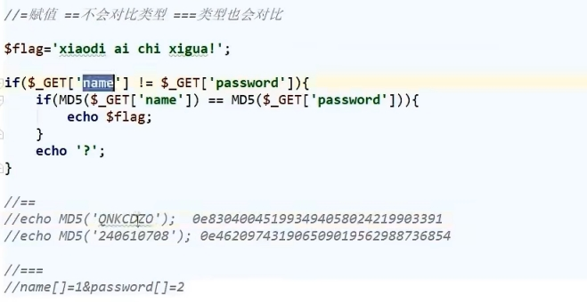

分析源码

post传入a，b1，b2，c1，c2

 

preg_match数组绕过

intval 空格绕过

 

b1和b2值不相等，但是它们md5值相等

 

C1与c2不等 c1和c2都是或都不是字符串并且c1和c2的md5值相等

==弱类型检验绕过

 

 

 

 

构造payload：

首先a：

a[]数组绕过preg_match

a[]=%201  %20 空格绕过intval（此处可以忽略）

b1和b2：

===md5检验

数组

b1[]=1&b2[]=2

 

c1和c2：

==md5检验

c1=QNKCDZO&c2=240610708

 

 

最终payload：

a[]=%201&b1[]=1&b2[]=2&c1=QNKCDZO&c2=240610708

 

 

得到flag

 

 

 