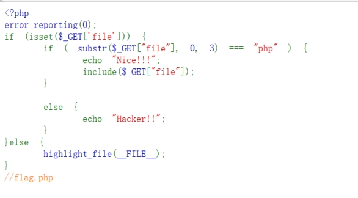
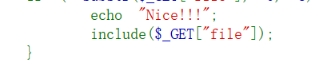
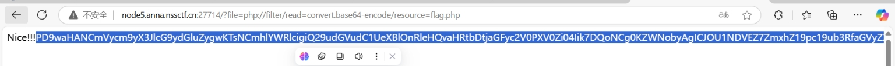
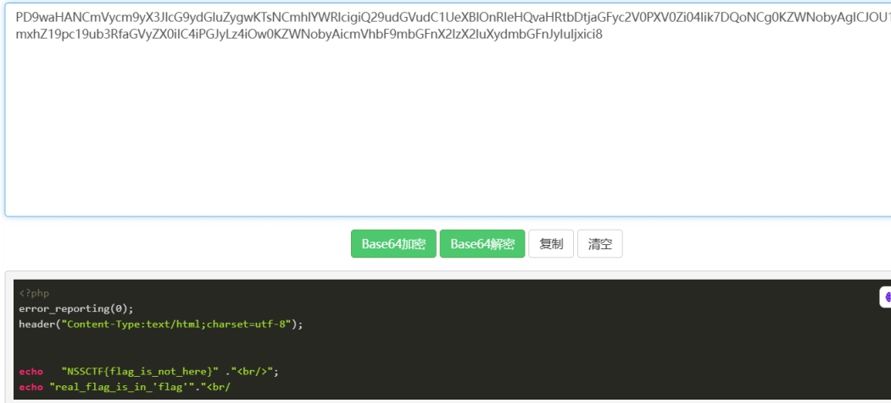
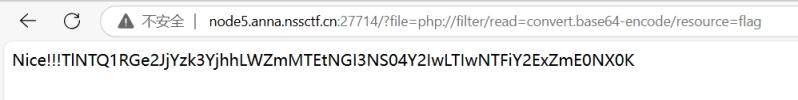
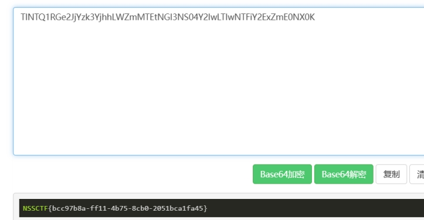

 

分析源码

get传参file

Substr判断file从第0位开始三位是否为php

如果满足则

 

包含文件

尾部提示flag.php

尝试php伪协议

构造payload：

File=php://filter/read=convert.base64-encode/resource=flag.php

 

解码

 

提示真的flag在"flag"

修改payload

直接读取flag

 

 

 

 

 