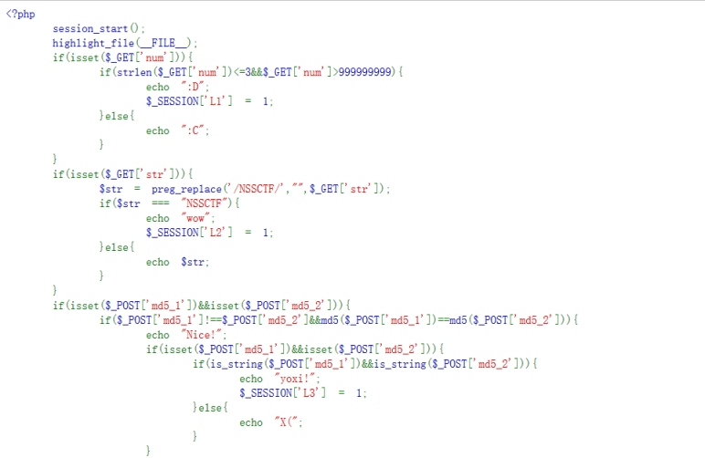
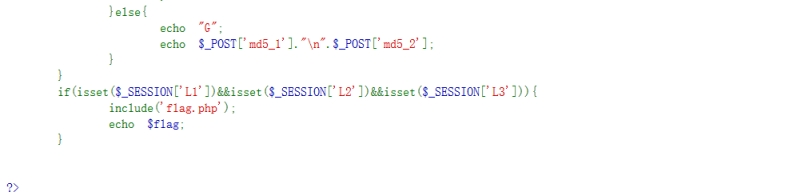
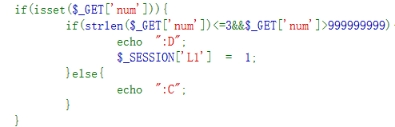
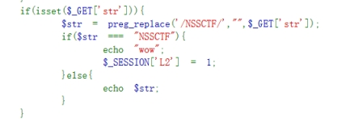
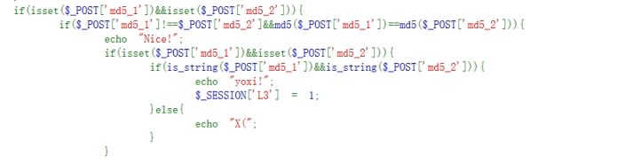
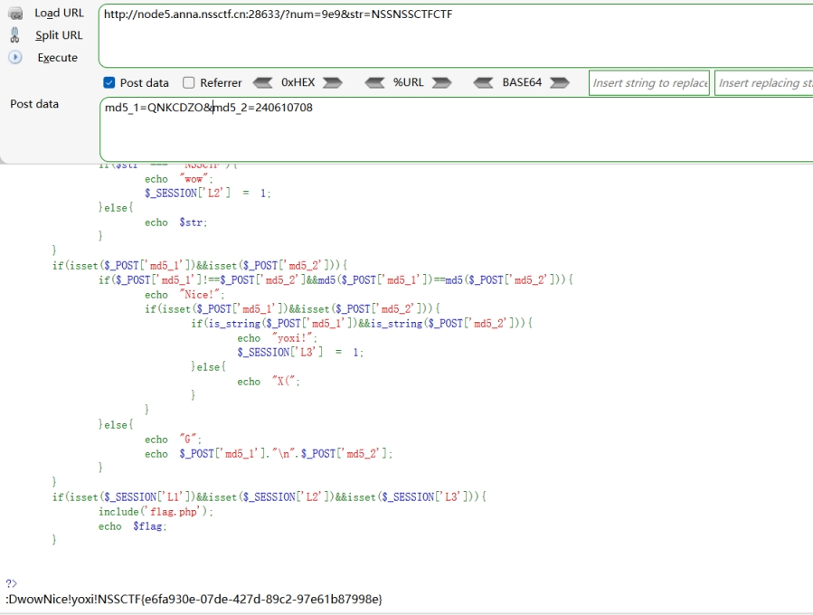

 

 

 

分析源码

首先：

 

get方式传参num

判断num的长度要小于3，且num又要大于999999999

科学计数法

num=9e9

 

接着

 

get方式传参str

将str中的NSSCTF替换为空

且判断str仍为NSSCTF

双写绕过

str=NSSNSSCTFCTF

 

 

 

post方式传入md5_1和md5_2

如果md5_1和md5_1不相等且它们两个的md5值相同

md5_1=QNKCDZO

md5_2=240610708

 

得到flag

 

 

 