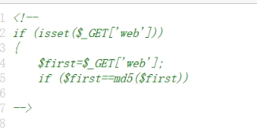
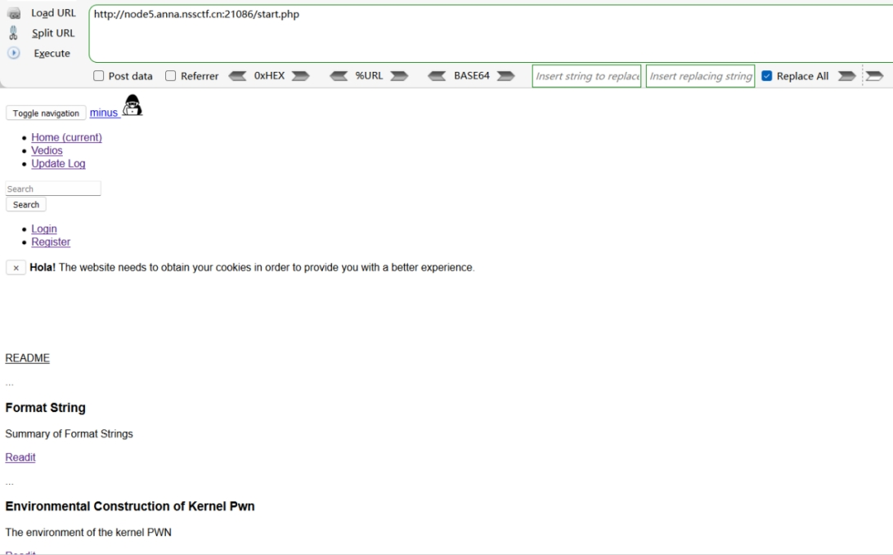
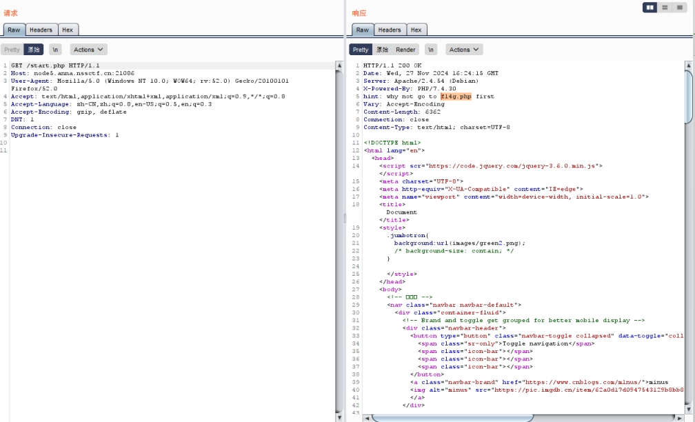
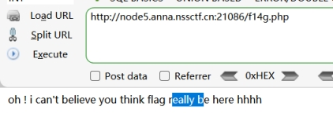
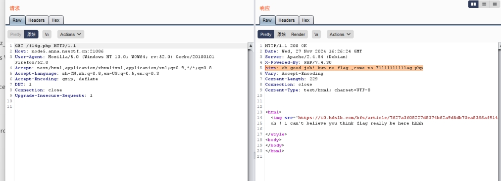
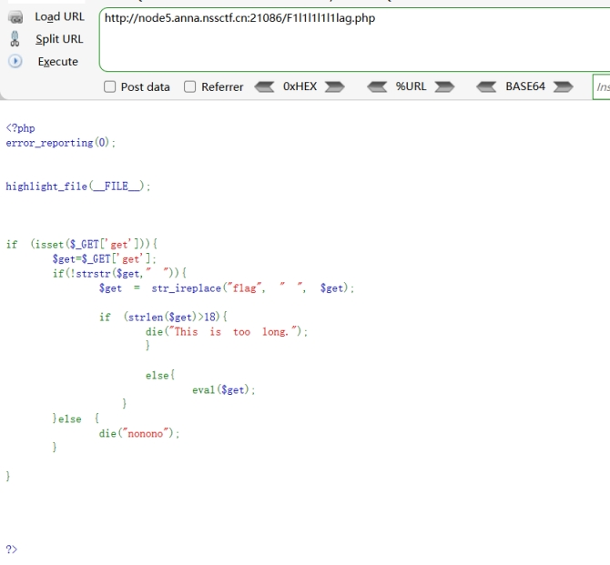
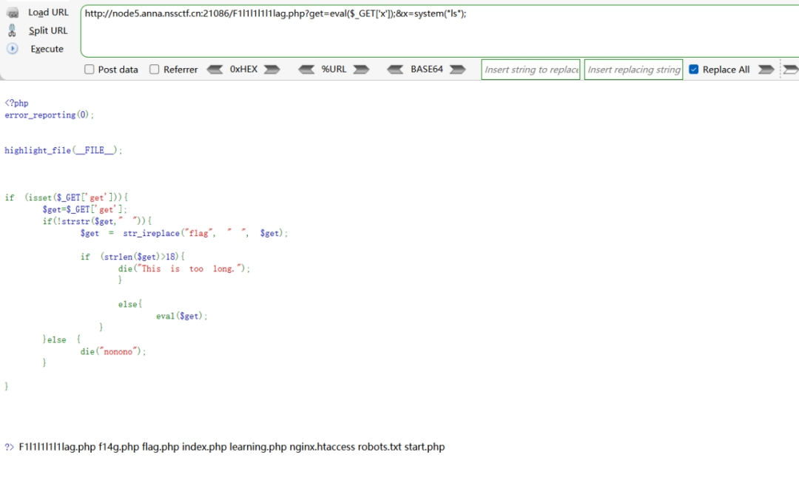
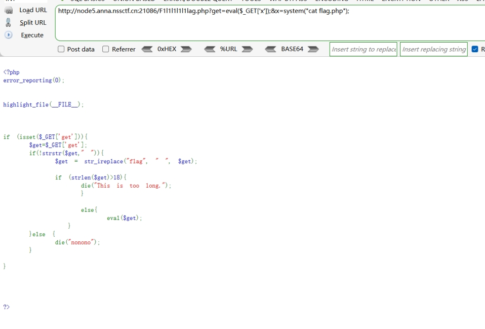
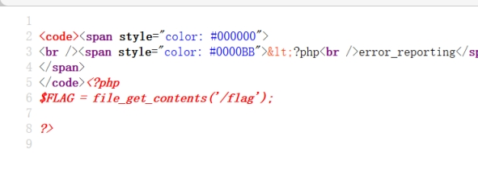
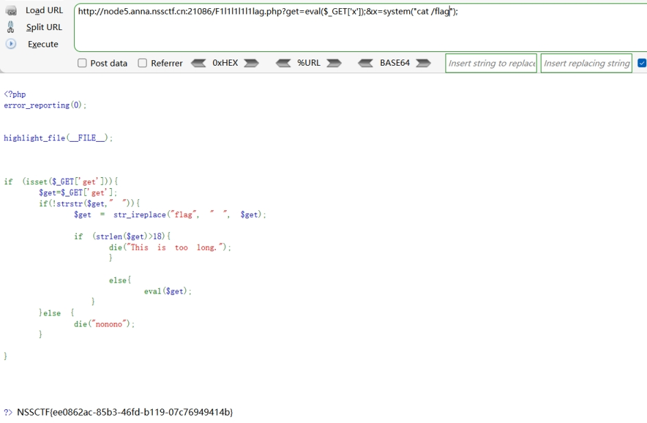

查看源码

 

 

使传参的web进行md5加密前后的值相同

构造payload

?web=0e215962017

跳转到

 

 

页面无发现

抓包

 

提示先访问f14g.php

 

抓包

 

访问

 

 

分析源码

get传参get

将传入的flag替换为" "

 

并且判断传入的长度是否大于十八

 

于是我们采用 嵌套 eval() 

既然 get 参数的值存在限制，那么我们可以将 get 的值设置为 eval($_GET['?']); （理论上，? 可以表示任何文本）来接收另一个参数名为 ? 的值并将其作为 PHP 代码执行。

这样，判断语句将检查 get 参数，而 实际起破坏作用的代码却被我们转移到了另一个参数 ? 中。对此，构造如下查询字符串 我们构造 payload:?get=eval($_GET['x']);&x=system('ls');

 

 

查看源码

 

 

 

 

 