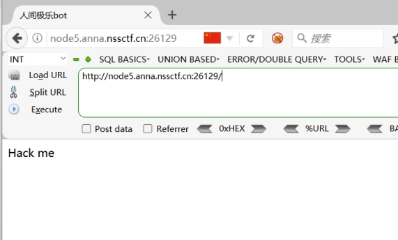
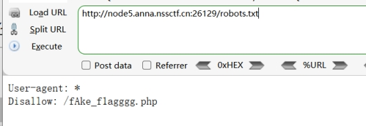
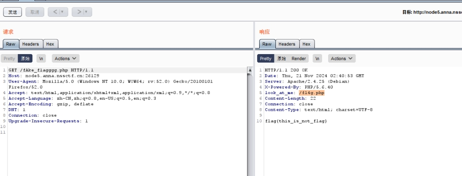
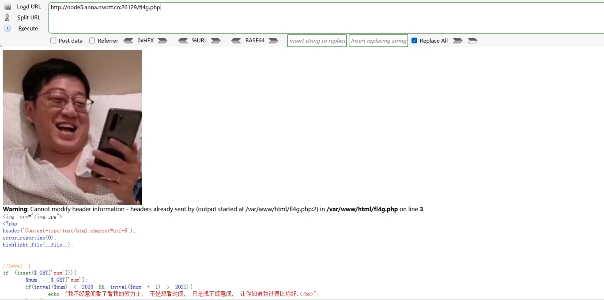
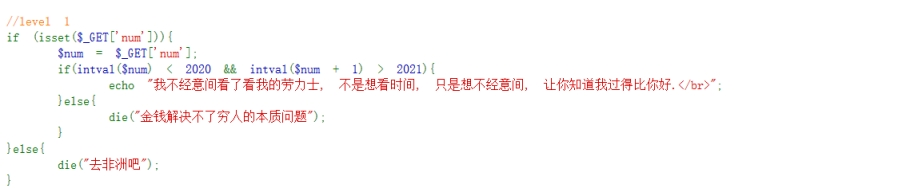
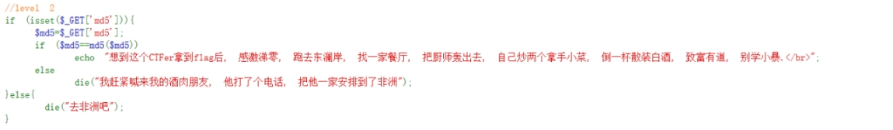
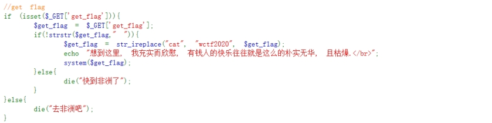
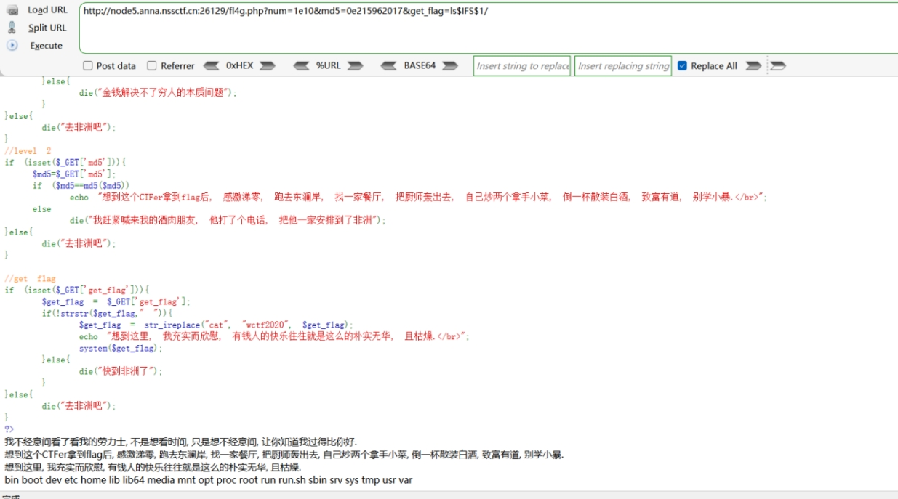
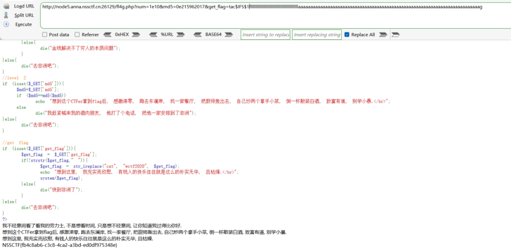

 

 

Title bot

可能存在robots.txt

查看

 

访问是假的flag

 

bp抓包

 

存在fl4g.php

访问

 

得到源码

分析

 

 

 

get传参num

num<2020  但是 num + 1 > 2021

“1e10”

1e10 = 1*10^10

Intval(1e10)

字母截断，输出是1

字符串1e10+1 == 1*10^10 +1 > 2021

 

构造payload:

?num=1e10

 

 

 

 

 

get传参md5

使md5的值与其md5加密后的值相同

==弱类型判断

找加密前后都是0e开头的，且后面都是数字的md5（转换为科学计数法来比较，都为0）

即0e215962017

 

构造payload：

md5=0e215962017

 

 

 

get传参get_flag

首先过滤空格，其次将cat替换为wctf2020

命令执行

尝试{IFS}

ls{$IFS}/

无回显

 

尝试$IFS$1

ls$IFS$1/

 

成功

查看目录得到flag（因为cat被过滤，使用tac代替cat）

 

 

最终payload:

?num="1e10"&md5=0e215962017&get_flag=

ls{$IFS}/

 