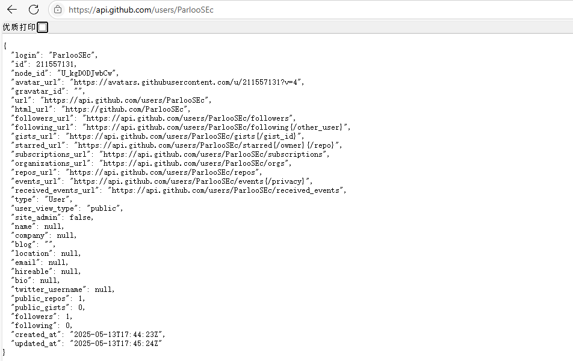

# 题目列表

```
应急响应主线
1.提交堡垒机中留下的flag
2.提交WAF中隐藏的flag
3.提交Mysql中留下的flag
4.提交攻击者的攻击IP
5.提交攻攻击者最早攻击时间flag格式为palu{xxxx-xx-xx-xx-xx-xx}
6.提交web服务泄露的关键文件名
7.题解泄露的邮箱地址
8.提交立足点服务器ip地址
9.提交攻击者使用的提权的用户和密码
10.提交攻击者留下的的文件内容作为flag提交
11.提交权限维持方法的名称
12.提交攻击者攻击恶意服务器连接地址作为flag提交
13.找到系统中被劫持的程序程序名作为flag提交
14.找到系统中存在信息泄露的服务运行端口作为flag提交
15.提交Parloo公司项目经理的身份证号作为flag提交
16.提交存在危险功能的操作系统路径作为flag提交。flag格式为palu{/xxx/xxx}
17.提交进源机器中恶意程序的MD5作为flag进行提交。 flag格式为palu{MD5小写}
18.提交攻击者留下的恶意账户名称md5后作为flag进行提交。 格式为palu{md5{xxxxx}}
19.提交内部群中留下的flag并提交
20.请提交攻击者使用维护页面获取到的敏感内容作为flag进行提交
21.提交获取敏感内容IP的第一次执行命令时间作为flag进行提交。flag格式为palu{xxxx-xx-xx:xx:xx:xx}
22.提交攻击者使用的恶意ip和端口flag格式为palu{xx.xx.xx.xx:xxxx}
23.提交重要数据的内容作为flag提交
24.提交恶意维权软件的名称作为flag进行提交
25.提交恶意程序的外联地址
26.提交攻击这使用的恶意dnslog域名作为flag进行提交
27.提交寻找反序列化漏洞的端口作为flag进行提交
28.提交web服务泄露的密钥作为flag进行提交
29.提交攻击者开始攻击的时间作为flag进行提交。flag各式为palu{xxxx/xx/xx:xx:xx:xx}
30.提交攻击者在server中留下的账户密码作为flag进行提交。flag格式为palu{username/password}
31.提交攻击者维权方法的名称作为flag进行提交
32.提交攻击者留下的木马md5后作为flag进行提交
33.提交攻击者留下的溯源信息作为flag进行提交
34.提交攻击者的githubID作为flag进行提交
35.提交攻击者在github下留下的的内容作为flag进行提交
36.提交恶意用户的数量作为flag进行提交
37.提交恶意用户的默认密码作为flag进行提交
38.提交业务数据中攻击者留下的信息作为flag进行提交
39.提交私人git仓库中留下的内容作为flag进行提交
40.提交存在在mysql服务器中的恶意程序的MD5作为flag进行提交
41.提交恶意程序中模拟c2通信的函数名称作为flag进行提交
42.提交恶意程序创建隐藏文件的名称作为flag提交
43.提交恶意程序中模拟权限提升的函数作为flag进行提交
44.提交被钓鱼上线的用户名作为flag进行提交
45.提交恶意程序的所在路径作为flag进行提交
46.分析恶意程序的反连地址作为flag进行提交
47.提交恶意c2的服务器登录的账号密码作为flag进行提交。flag格式为palu{username/password}
```


## 1.提交堡垒机中留下的flag


```
palu{2025_qiandao_flag}
```


## 2.提交WAF中隐藏的flag

身份认证-->配置


```
palu{2025_waf}
```


## 3.提交Mysql中留下的flag

1Panel控制面板中可以看到flag数据库，


在该目录中找到数据库中数据

```
/opt/1panel/apps/mysql/mysql/data/flag
```


```
palu{Mysql_@2025}
```


## 4.提交攻击者的攻击IP

查看waf


其中192.168.20.107存在大量攻击行为，而192.168.20.108是sshserver主机，初步推测攻击者后续获取到了sshserver的控制权限，接着利用sshserver服务器发起攻击。

```
palu{192.168.20.107}
```


## 5.提交攻攻击者最早攻击时间flag格式为palu{xxxx-xx-xx-xx-xx-xx}


```
palu{2025-05-05-00-04-40}
```


## 6.提交web服务泄露的关键文件名

查看waf，共防护四个web应用，


保存日志


简单查看，其中80端口攻击者通过目录扫描扫到了一个/bak/key.txt文件


ssh密钥对

```
palu{key.txt}
```


## 7.题解泄露的邮箱地址


```
palu{parloo@parloo.com}
```


## 8.提交立足点服务器ip地址

攻击者获取到了ssh密钥对，结合前面waf防护日志所得，判断攻击者利用该密钥对成功登录了sshserver服务器，因此立足点服务器ip地址为192.168.20.108

```
palu{192.168.20.108}
```


## 9.提交攻击者使用的提权的用户和密码

首先，赛方提供的ubuntu用户账号可以sudo执行任何命令


因此可以通过

```
sudo su
```

进行提权，提权的用户和密码

查看/etc/passwd


存在parloo用户

读取/etc/shadow


本地爆破


```
palu{parloo:parloo}
```

还有一种解法，尝试弱口令

还有一种就是，DiskGenius提取虚拟磁盘，然后保存/etc/shadow，尝试本地爆破


## 10.提交攻击者留下的的文件内容作为flag提交

```
/home/parloo/parloo_flag01
```


```
palu{hi_2025_parloo_is_hack}
```


另一种思路，查看waf


攻击者的大概攻击时间

从2025-05-04到2025-05-07

那么我们可以尝试利用find命令查找2025-05-04到2025-05-08之间被修改的文件

```
find . -type f -newerct "2025-05-04 00:00"  ! -newerct "2025-05-07 23:59" 
```


首先可以看到/usr/bin目录下存在两个可疑文件


然后就可以看到/home/parloo/parloo_flag01文件


## 11.提交权限维持方法的名称

权限维持，先查看systemctl status

```
systemctl status
```


其中，rootset-test.service和rootset.service运行/usr/bin目录下的可疑文件/usr/bin/b4b40c44ws

进入/etc/systemd/system目录


```
cat rootset-test.service
cat rootset.service
```


利用DiskGenius将b4b40c44ws保存到本地，按修改时间排序，还有新的发现，id命令也被修改过


而result.txt应该是fscan此类的内网信息收集工具的扫描结果


IDA查看b4b40c44ws


查看id


不懂逆向，因此不能分析该恶意木马行为，但是可以判断出存在可疑ip


```
palu{rootset}
```


## 12.提交攻击者攻击恶意服务器连接地址作为flag提交

```
palu{47.101.213.153}
```


## 13.找到系统中被劫持的程序程序名作为flag提交

```
palu{id}
```


结合前面所得，攻击者可能是通过

[192.168.20.102/bak/key.txt](http://192.168.20.102/bak/key.txt)页面获取到ssh密钥对，然后初步获取了sshserver服务权限，并创建了恶意用户parloo，利用rootset服务实现持久化利用，并修改了id命令


## 14.找到系统中存在信息泄露的服务运行端口作为flag提交

这题我本来以为是泄露了ssh密钥对的端口，但是提交不对，然后又翻了一下，1Panel控制面板中存在两个url，访问[Parloo人事管理系统](http://192.168.20.103:8081/)


暴露用户信息

```
palu{8081}
```


## 15.提交Parloo公司项目经理的身份证号作为flag提交

访问[Parloo人事管理系统](http://192.168.20.103:8081/)，查看源码


或者点击编辑


```
palu{310105198512123456}
```


## 16.提交存在危险功能的操作系统路径作为flag提交。flag格式为palu{/xxx/xxx}


访问[parloo服务器维护页面](http://192.168.20.103:8080/admin/parloo)


```
palu{/admin/parloo}
```


## 17.提交进源机器中恶意程序的MD5作为flag进行提交。 flag格式为palu{MD5小写}

打开近源机器，打开后就报错


不知道是题目设计还是有问题，存在svhost.exe

利用volatility（先拍摄快照，然后利用volatility读取快照）

```
vol.py -f palu03.vmem imageinfo
```


但是后续有些问题，我记得当时做题的时候是pslist存在svhost.exe，然后filescan也可以扫到该文件，但是现在不知道哪里有问题


留个坑

```
C:\Windows\Temp
```


存在svhost.exe


```
palu{0f80a82621b8c4c3303d198d13776b34}
```


## 18.提交攻击者留下的恶意账户名称md5后作为flag进行提交。 格式为palu{md5{xxxxx}}

```
vol.py -f palu03.vmem --profile Win7SP1x64 hashdump
```


```
echo "hack:1003:aad3b435b51404eeaad3b435b51404ee:f39934a2710a469b3c63ce1487794514
:::" > hack
john --format=nt hack
```


奥奥，题目只说了恶意账户名称


```
palu{d78b6f30225cdc811adfe8d4e7c9fd34}
```


## 19.提交内部群中留下的flag并提交


```
palu{nbq_nbq_parloo}
```


## 20.请提交攻击者使用维护页面获取到的敏感内容作为flag进行提交


或是DiskGenius打开虚拟磁盘文件


```
palu{Server_Parloo_2025}
```


## 21.提交获取敏感内容IP的第一次执行命令时间作为flag进行提交。flag格式为palu{xxxx-xx-xx:xx:xx:xx}


```
palu{2025-05-04-15:30:38}
```


## 22.提交攻击者使用的恶意ip和端口flag格式为palu{xx.xx.xx.xx:xxxx}


攻击者尝试利用nc和bash反弹shell

```
palu{10.12.12.13:9999}
```


## 26.提交攻击者使用的恶意dnslog域名作为flag进行提交


```
palu{requestrepo.com}
```


## 24.提交恶意维权软件的名称作为flag进行提交


```
palu{svhost}
```


## 25.提交恶意程序的外联地址

```
C:\Users\Parloo
```


发现可疑文件

本地利用pyinstxtractor解包


反编译恶意程序1.pyc


```
palu{88.173.90.103}
```


## 27.提交寻找反序列化漏洞的端口作为flag进行提交

结合之前的日志，9999端口存在shiro反序列化


```
palu{9999}
```


## 28.提交web服务泄露的密钥作为flag进行提交

/opt目录下存在adminAF.jar

jd-gui解包


```
palu{QZYysgMYhG6/CzIJlVpR2g==}
```


## 29.提交攻击者开始攻击的时间作为flag进行提交。flag各式为palu{xxxx/xx/xx:xx:xx:xx}


```
palu{2025/05/13:16:45:19}
```


## 30.提交攻击者在server中留下的账户密码作为flag进行提交。flag格式为palu{username/password}


保存/etc/shadow

简单处理


```
palu{parloohack:123456}
```


## 31.提交攻击者维权方法的名称作为flag进行提交

systemctl status没发现可疑内容

排查/etc/systemd/system目录

按时间排序，存在proloohack_script.service，执行python3.3.py


```
palu{parloohack_script.service}
```


## 32.提交攻击者留下的木马md5后作为flag进行提交

parloohack的家目录中还存在aa文件


存在外连行为


```
palu{4123930b3911556d4bf79196cc008bf4}
```


## 33.提交攻击者留下的溯源信息作为flag进行提交

浏览器，密码填充


## 34.提交攻击者的githubID作为flag进行提交

上一题的账号为qq号，搜索发现


空间中得到github用户名

ParlooSEc

使用API进行查询



```
palu{211557131}
```


## 35.提交攻击者在github下留下的的内容作为flag进行提交


```
palu{s5o3WkX33hptyJjk}
```


## 36.提交恶意用户的数量作为flag进行提交


```
palu{99}
```


## 37.提交恶意用户的默认密码作为flag进行提交

上传mimikatz，抓取hash


```
mimikatz.exe
privilege::debug
lsadump::sam /sam:SAM.save /system:SYSTEM.save
```


提取哈希，本地爆破


```
palu{123456}
```


## 38.提交业务数据中攻击者留下的信息作为flag进行提交


```
palu{crP1ZIVfqrkfdhGy}
```


## 39.提交私人git仓库中留下的内容作为flag进行提交

私人仓库

1Panel控制台，进入终端，/opt/1panel/apps/gitea/gitea/data/git/repositories/admin/palu.git目录

```
git reflog
```


```
git show 260a8c1
```


```
palu{FO65SruuTukdpBS5}
```

另一种，[更改Gitea中的管理密码-腾讯云开发者社区-腾讯云](https://cloud.tencent.com/developer/ask/sof/114914115)

进入gitea容器


尝试gitea命令修改密码，不允许root运行，查看/etc/passwd，存在git用户，切换为git


```
gitea admin user change-password -u admin -p 123456789
```


同样，利用此方法也可以修改hack用户密码


其中存在encode.py


## 23.提交重要数据的内容作为flag提交

结合得到的encode.py

解密数据即可，但是我不会


## 40.提交存在在mysql服务器中的恶意程序的MD5作为flag进行提交

DiskGenius打开mysql服务器虚拟磁盘文件，按时间排序，很快就能筛选出/root目录下的.a隐藏文件


IDA打开，简单分析


其实从函数名称大概也能看出来其行为

```
create_hidden_file
创建隐藏文件
```

```
simulate_network_communication
建立网络通信
```

```
create_child_process
创建子进程
```

```
simulate_privilege_escalation
提权
```

```
simulate_encryption
加密
```


```
palu{ba7c9fc1ff58b48d0df5c88d2fcc5cd1}
```


## 41.提交恶意程序中模拟c2通信的函数名称作为flag进行提交

```
simulate_network_communication
建立网络通信
```

```
palu{simulate_network_communication}
```


## 42.提交恶意程序创建隐藏文件的名称作为flag提交

```
create_hidden_file
创建隐藏文件
```

```
palu{create_hidden_file}
```


## 43.提交恶意程序中模拟权限提升的函数作为flag进行提交

```
simulate_privilege_escalation
提权
```

```
palu{simulate_privilege_escalation}
```


## 44.提交被钓鱼上线的用户名作为flag进行提交


```
palu{Parloo-子怡}
```


## 45.提交恶意程序的所在路径作为flag进行提交


```
palu{C:\Users\Public\Nwt\cache\recv\Parloo-沉沉}
```


## 46.分析恶意程序的反连地址作为flag进行提交


```
palu{47.101.213.153}
```


## 47.提交恶意c2的服务器登录的账号密码作为flag进行提交。flag格式为palu{username/password}

浏览器，密码记录


```
palu{admin/admin@qwer}
```

