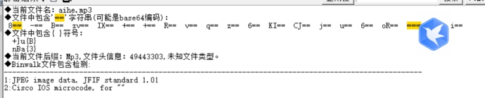

解压需要密码

 

扫描得知为伪加密

伪加密修复解压得到

 

扫描后得知其中隐藏了一张jpg文件

 

foremost分离

打开jpg文件

发现高度有点低

010打开后根据模板未找到高度模块（可以根据图片信息895*371  895转为十六进制是 0x37F 010全局搜索0x37F可以找到宽高 修改高度）

 

 

成功修改高度后得到

 

猪圈密码

[CTF在线工具-在线猪圈密码加密|在线猪圈密码解密|猪圈密码算法|Pigpen Cipher (hiencode.com)](http://www.hiencode.com/pigpen.html)

 

 

解密后得到well done

即为flag

 

 