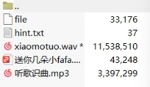
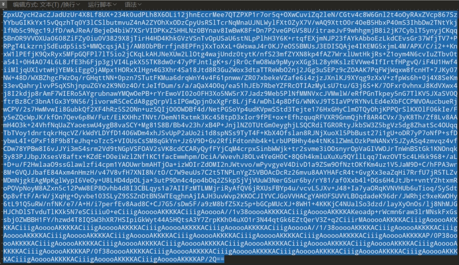
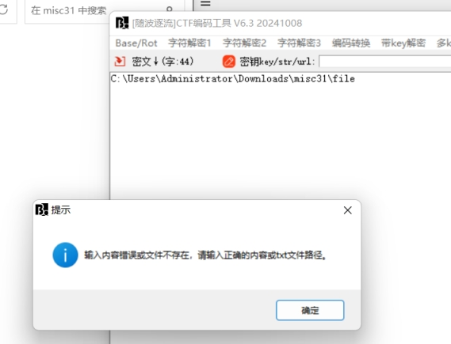
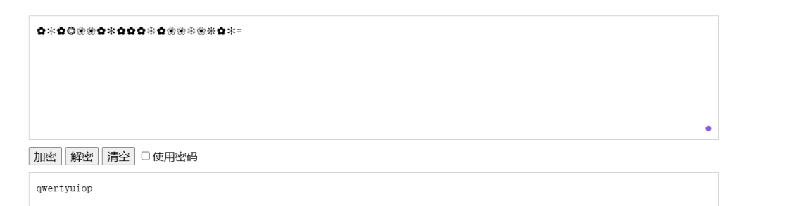
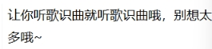
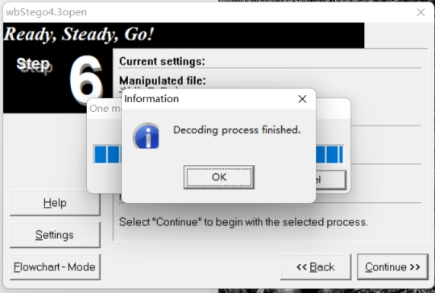
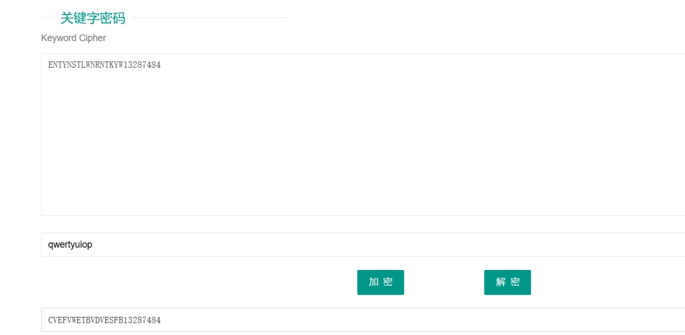
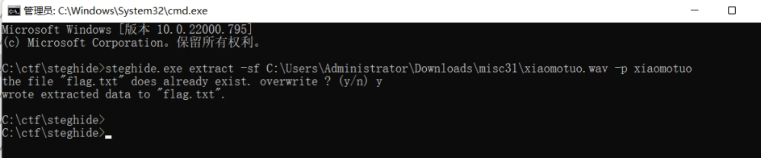

得到一个压缩包

 

其中 file hint.txt 听歌识曲.mp3可以直接解压

打开010 打开file文件

 

==结尾

推测是base 64转图片

 

提示失败（查资料发现要修改后缀名后再转）

得到一张png图片

 

 

利用dlddddhm成功解压出送你几朵小fafa.pdf

 

打开后发现是花朵加密

[文本加密为花朵符号,可自设密码|文本在线加密解密工具 (qqxiuzi.cn)](https://www.qqxiuzi.cn/bianma/wenbenjiami.php?s=huaduo)

解密后得到

 

利用解密后的密码无法解压出最后一个文件

打开hint.txt文件

 

打开听歌识曲.mp3

是林俊杰的关键字

推测是关键字加密

因为是pdf文件

利用wbStego4.3open解密（无密码）

 

得到ENTYNSTLWNRNTKYW13287484

利用关键字解密

 

 

 

利用密码成功解压xiaomotuo.wav

Audacity查看后无异常

steghide扫描需要密码

利用文件名xiaomotuo作为密码

 

成功得到flag

 

 