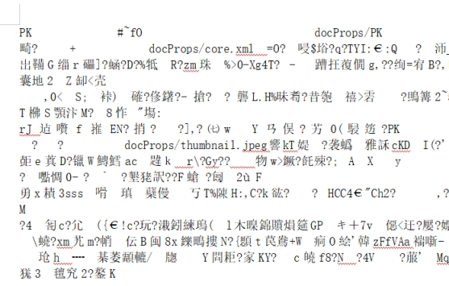
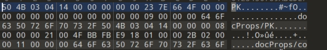
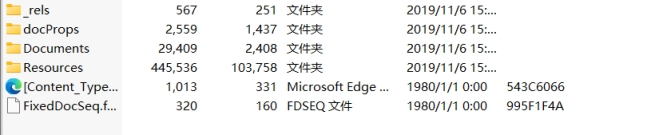
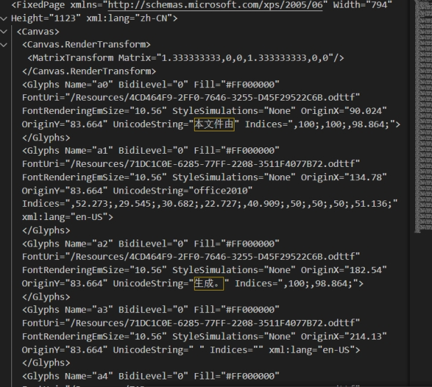

rar.rar文件

解压得到办公文档.doc

打开后提示会乱码

 

 

 

开头显示PK，猜测是压缩包

010打开

 

文件头 50 4B 03 04

zip文件，修改扩展名为zip

 

将里面的内容解压

最终发现在Documents/1/Pages/1.fpage中存在flag

 

将UnicodeString后的文字提取出来拼接得到flag

flag{xps?Oh,Go0d!}

 