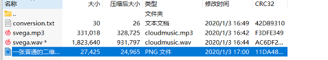
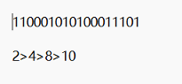
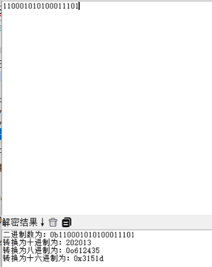
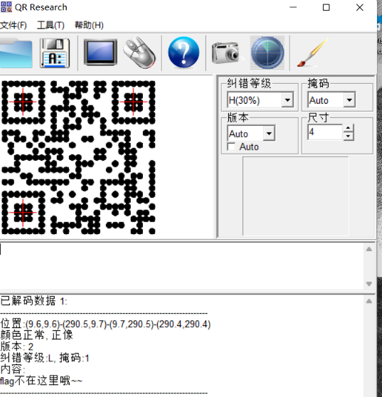
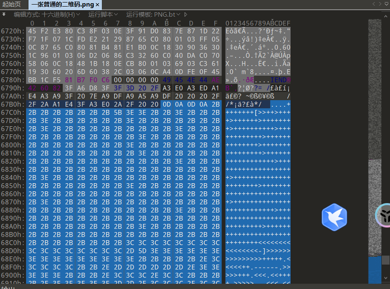
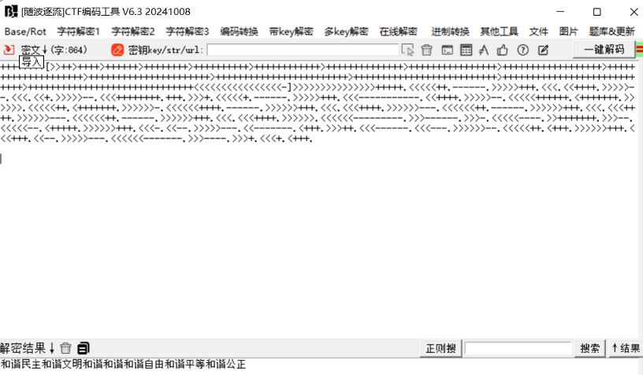
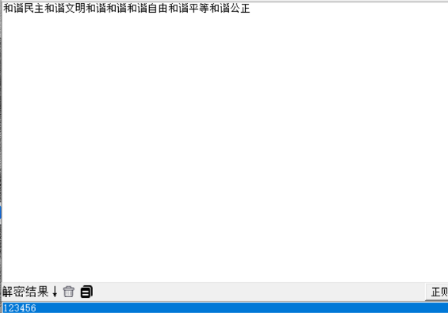
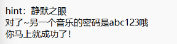
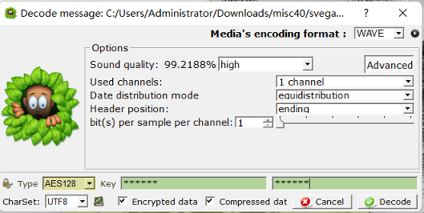
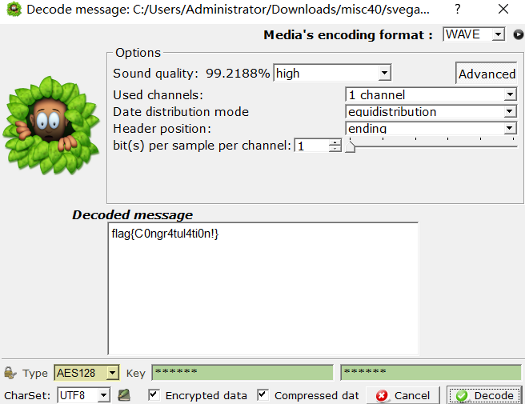

打开压缩包

其中只有svega.wav需要解压密码

将其中三个解压

 

Conversion.txt打开后显示

推测是二进制转十进制

得到202013

利用其解压wav文件提示错误

 

打开二维码文件

提示flag不在这里

010打开

发现brainFuck加密

解密后得到社会主义核心价值观密文

将其解密得到123456

利用123456解压wav提示错误

 

利用MP3Stego提取mp3文件（需要进入MP3Stego文件下的MP3Stego中运行Decode.exe）

得到文本

提示静默之眼

silenteye软件

且密码为abc123

利用abc123将svega.wav文件解压

并用silenteye将其打开

decode解码

将参数：

Sound quality 设置为高

Type AES128

Key为未使用的202013

成功得到flag

