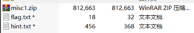
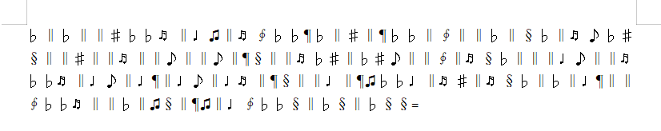
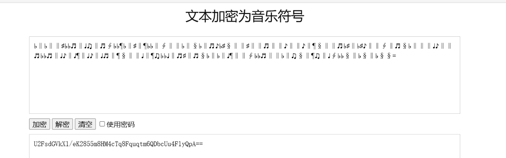
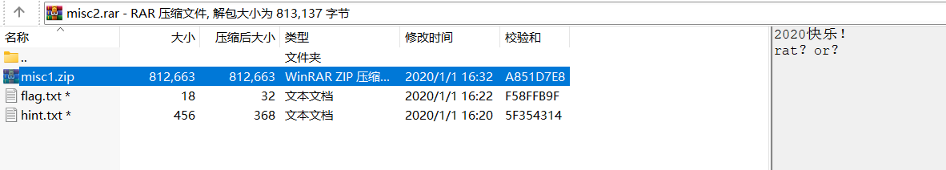
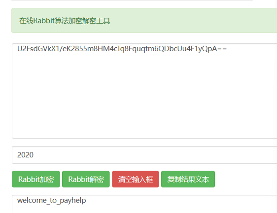
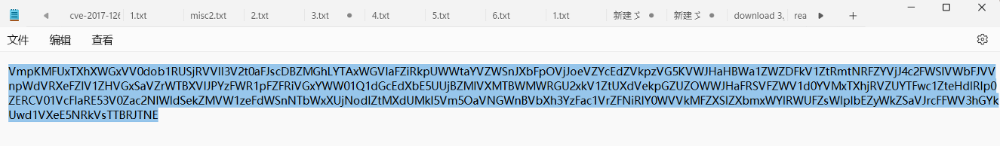
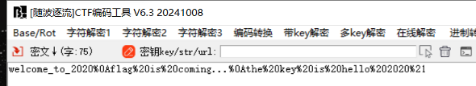
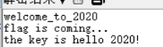

得到misc2压缩包

里面有三个文件

其中misc1.zip可以直接解压

另外两个要密码

进入misc1.zip

其中misc.png可以直接解压

music.doc需要密码

打开misc.png

爆破修复宽高后无结果

推测2020为music.doc的解压密码

成功解压后打开文件后是一串音符

进行音符解密

怀疑是base64编码

不对

（rabbit编码）

（misc2注释中说明）

进行rabbit解码

密码为2020

将解密出的内容作为解压密码可以解密出hint.txt

将文本中的内容进行六次base64解码(每次解码后删除%3d)

得到

进行url解码

使用hello 2020！解压flag.txt

得到flag

