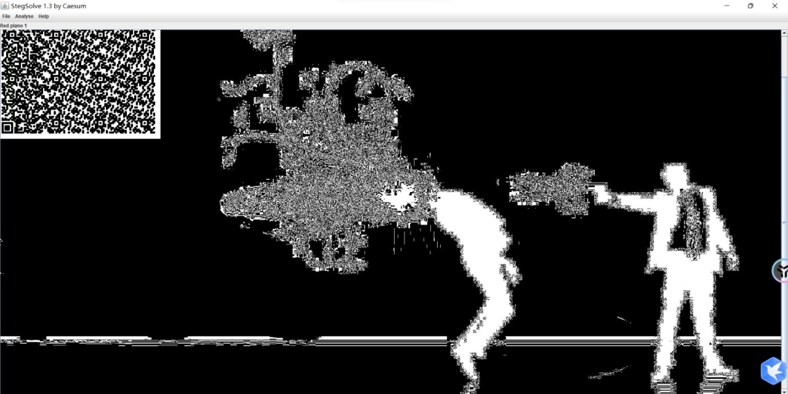
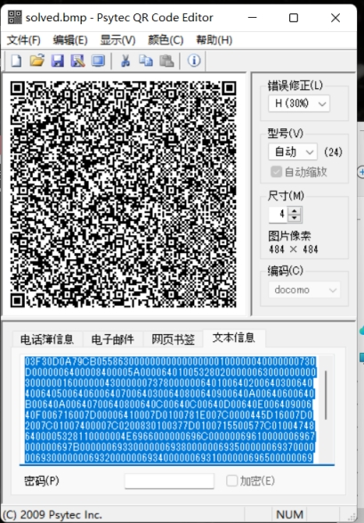
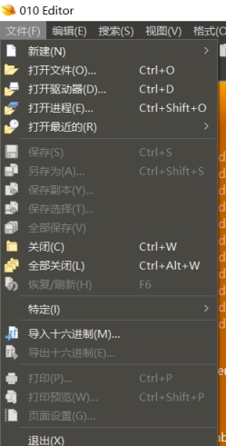
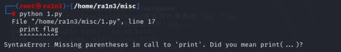
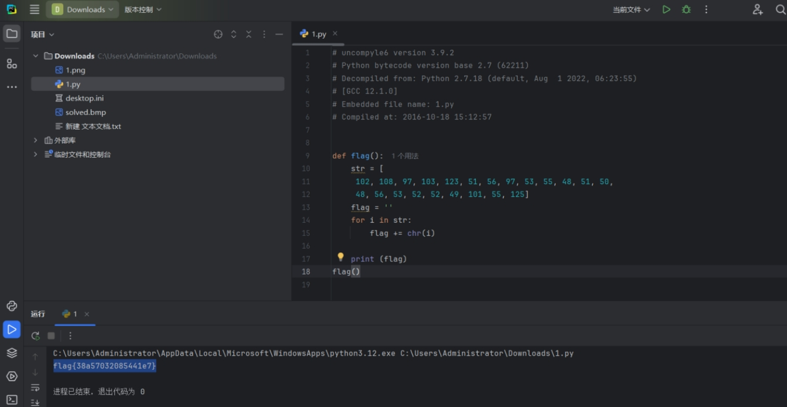

得到png图片

010打开无异常

exiftool无关键信息

扫描无异常

放进stegsolve中查看

发现有张二维码

 

 

扫描后得到十六进制数

 

 

 

03 F3 0D 0A

查了一下是pyc文件格式

010导入十六进制数

 

 

 

保存为pyc文件格式

放入kali中利用uncompyle6反编译得到py文件

 

运行报错

 

修改代码后得到flag

 

 

 