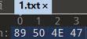
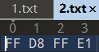
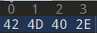
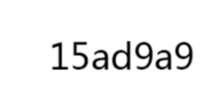
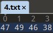
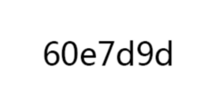
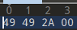
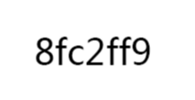
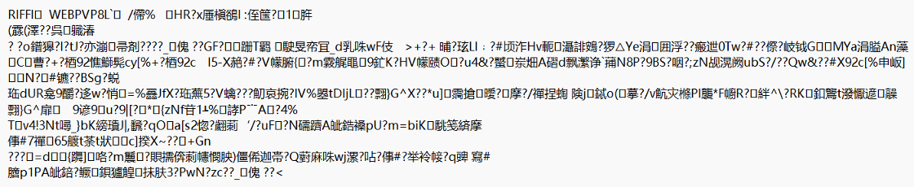

第一种解题思路：

 

解压后得到六个txt文件

利用010查看文件头判断原文件类型

png文件

修改后缀名后得到

jpg文件

修改后缀名为jpg后得到

bmp文件

修改后缀名为bmp后得到

（利用bmp图像查看器）

gif文件

修改后缀名为gif后得到

tif文件

修改后缀名为tif后得到

第六个无法根据文件头判断文件类型

打开txt文档

首行带有关键词 riffi

修改后缀名为 riffi后得到

拼一起得到flag