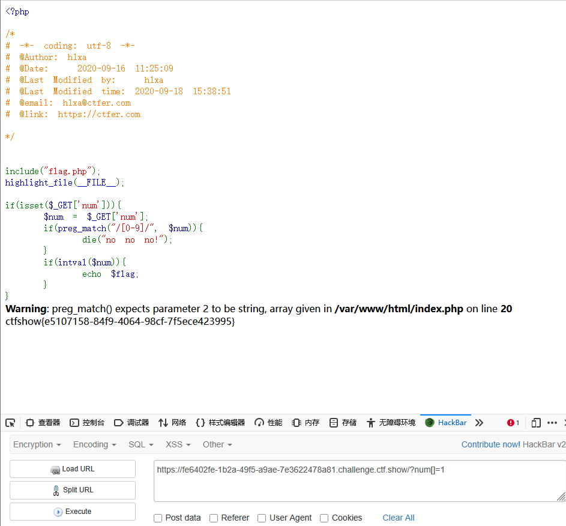

```
 <?php

/*
# -*- coding: utf-8 -*-
# @Author: h1xa
# @Date:   2020-09-16 11:25:09
# @Last Modified by:   h1xa
# @Last Modified time: 2020-09-18 15:38:51
# @email: h1xa@ctfer.com
# @link: https://ctfer.com

*/


include("flag.php");
highlight_file(__FILE__);

if(isset($_GET['num'])){
    $num = $_GET['num'];
    if(preg_match("/[0-9]/", $num)){
        die("no no no!");
    }
    if(intval($num)){
        echo $flag;
    }
} 
```

分析源码


get传参num

利用preg_match函数检查是否存在数字

且利用intval函数判断传入参数num是否为数字


preg_match只能处理字符串，如果不按规定传入字符串，通常是传入一个数组进去，这样就会报错


```
?num[]=1
```

