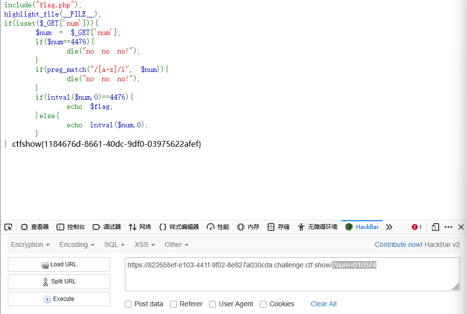
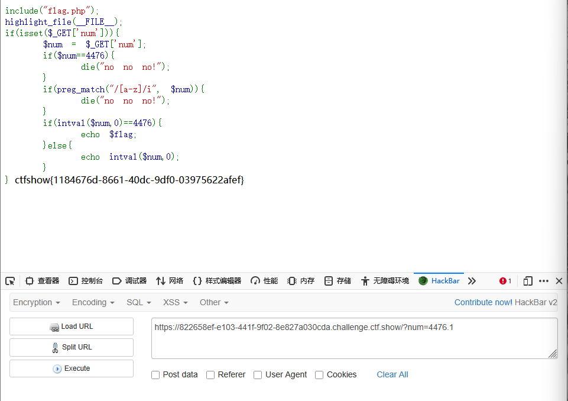

```
 <?php

/*
# -*- coding: utf-8 -*-
# @Author: Firebasky
# @Date:   2020-09-16 11:25:09
# @Last Modified by:   h1xa
# @Last Modified time: 2020-09-18 16:32:58
# @link: https://ctfer.com

*/

include("flag.php");
highlight_file(__FILE__);
if(isset($_GET['num'])){
    $num = $_GET['num'];
    if($num==4476){
        die("no no no!");
    }
    if(preg_match("/[a-z]/i", $num)){
        die("no no no!");
    }
    if(intval($num,0)==4476){
        echo $flag;
    }else{
        echo intval($num,0);
    }
} 
```


分析源码

get传入参数num

弱类型比较num的值是否为4476，如果是则报错

利用preg_match函数判断num中是否存在字母，如果存在则报错

利用intval函数判断num是否弱类型比较为4476，如果是则输出flag

同样，intval函数的$base的值为0，则可以利用进制绕过


但是由于preg_match函数过滤了字母

因此只能用八进制

```
?num=010574
```




或者使用小数点，利用intval将其解析为整数从而实现绕过

```
?num=4476.1
```

