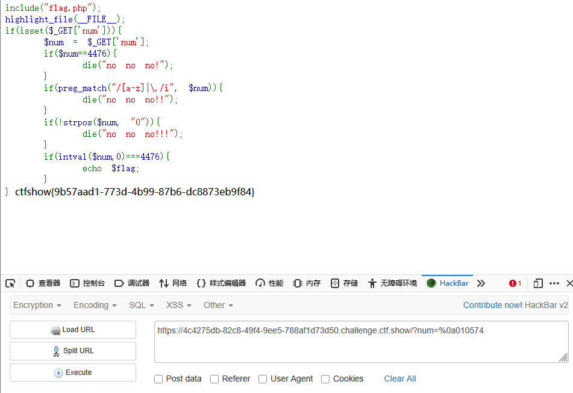

```
 <?php

/*
# -*- coding: utf-8 -*-
# @Author: h1xa
# @Date:   2020-09-16 11:25:09
# @Last Modified by:   h1xa
# @Last Modified time: 2020-09-18 16:53:59
# @link: https://ctfer.com

*/

include("flag.php");
highlight_file(__FILE__);
if(isset($_GET['num'])){
    $num = $_GET['num'];
    if($num==4476){
        die("no no no!");
    }
    if(preg_match("/[a-z]|\./i", $num)){
        die("no no no!!");
    }
    if(!strpos($num, "0")){
        die("no no no!!!");
    }
    if(intval($num,0)===4476){
        echo $flag;
    }
} 
```


同上题，但是多过滤一个点


同样利用%0a绕过strpos

```
?num=%0a010574
```

