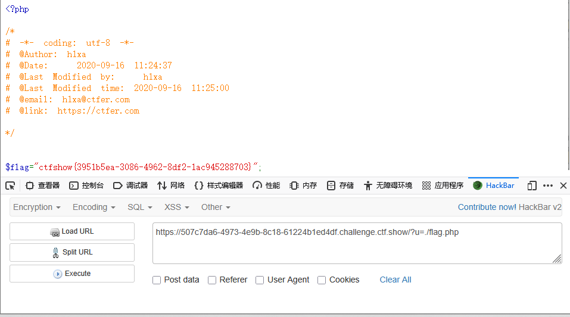
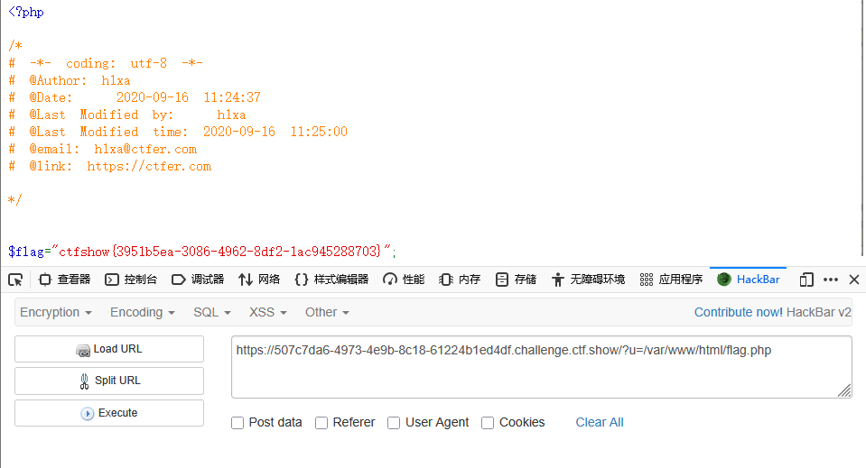

```
<?php

/*
# -*- coding: utf-8 -*-
# @Author: h1xa
# @Date:   2020-09-16 11:25:09
# @Last Modified by:   h1xa
# @Last Modified time: 2020-09-18 19:21:24
# @link: https://ctfer.com

*/


highlight_file(__FILE__);

if(isset($_GET['u'])){
    if($_GET['u']=='flag.php'){
        die("no no no");
    }else{
        highlight_file($_GET['u']);
    }


}

```

分析源码

get传入u

如果u弱类型比较等于flag.php，则报错

否则输出flag


第二种

利用./

表示匹配当前目录

```
?u=./flag.php
```




## 第二种

```
?u=/var/www/html/flag.php
```

