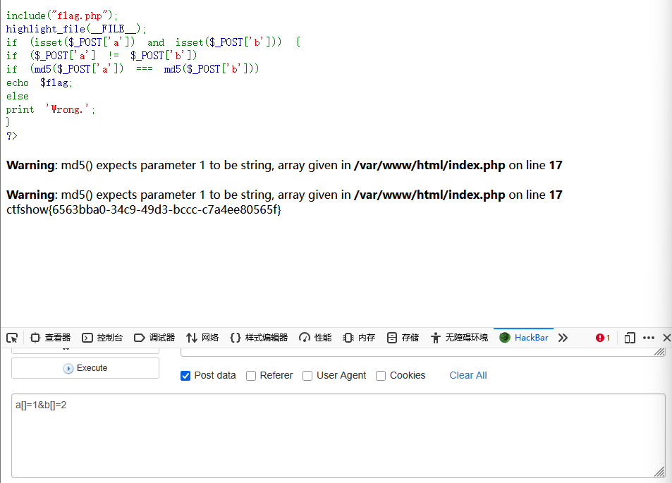

```
 <?php

/*
# -*- coding: utf-8 -*-
# @Author: h1xa
# @Date:   2020-09-16 11:25:09
# @Last Modified by:   h1xa
# @Last Modified time: 2020-09-18 19:36:32
# @link: https://ctfer.com

*/

include("flag.php");
highlight_file(__FILE__);
if (isset($_POST['a']) and isset($_POST['b'])) {
if ($_POST['a'] != $_POST['b'])
if (md5($_POST['a']) === md5($_POST['b']))
echo $flag;
else
print 'Wrong.';
}
?>

```

分析源码

POST传参a和b

md5强类型比较


数组绕过

POST

```
a[]=1&b[]=2
```

