提示

用户名admin

密码为shark63

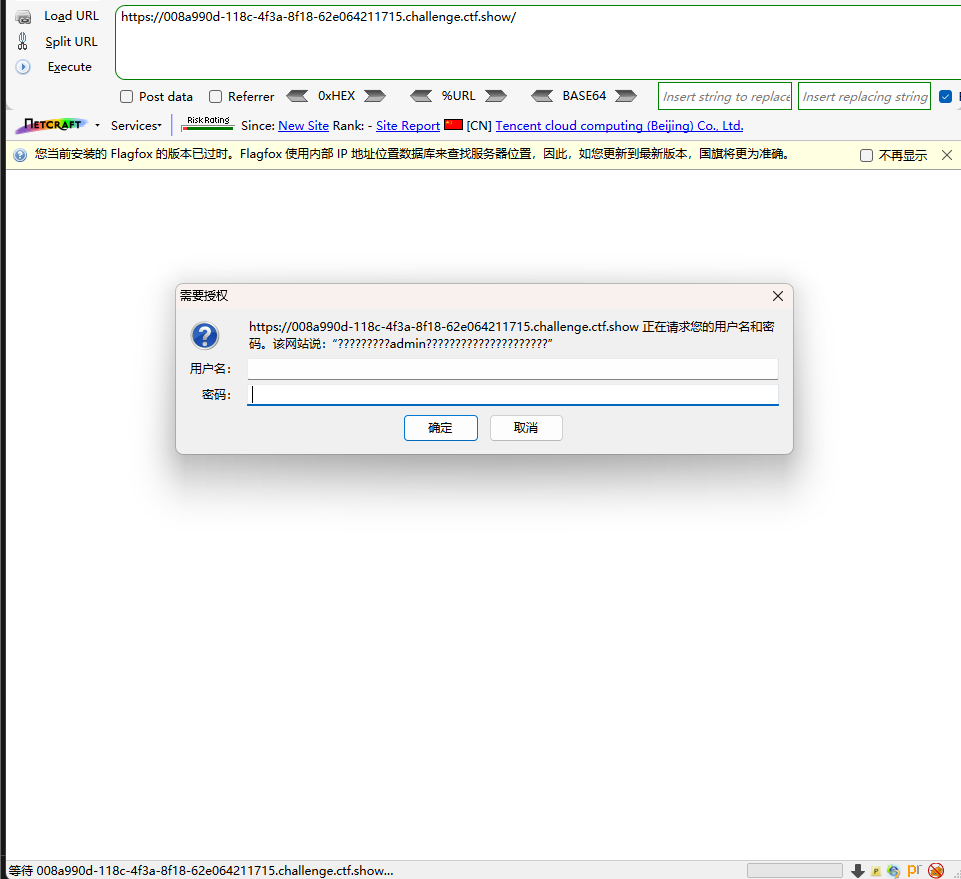

登录界面

随便输入账号密码

抓包

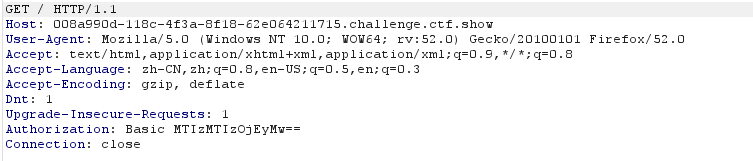

身份认证处，base64加密

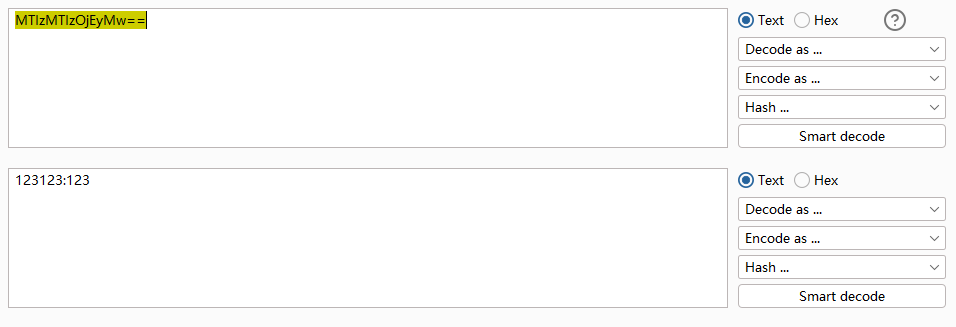

解码后得到密码规则

user:passwd

放入爆破模块

在身份认证出添加payload

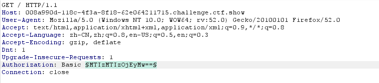

然后选择Custodm iterator

第一处导入字典（记得添加admin）

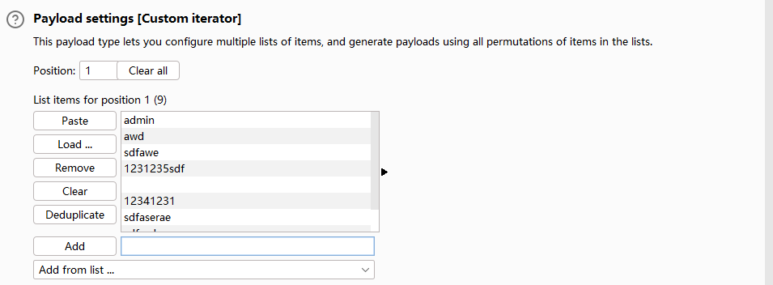

第二处为:

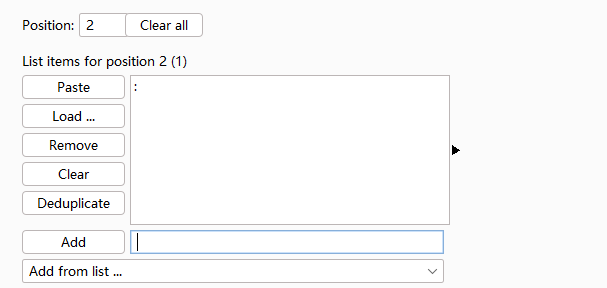

第三处添加密码（记得添加shark63）

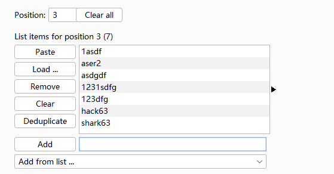

添加base64编码

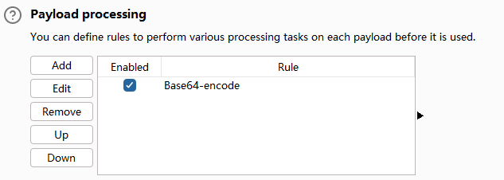

取消勾选URL编码

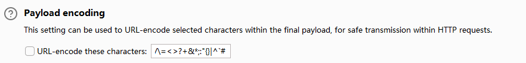

开始爆破

Length排序

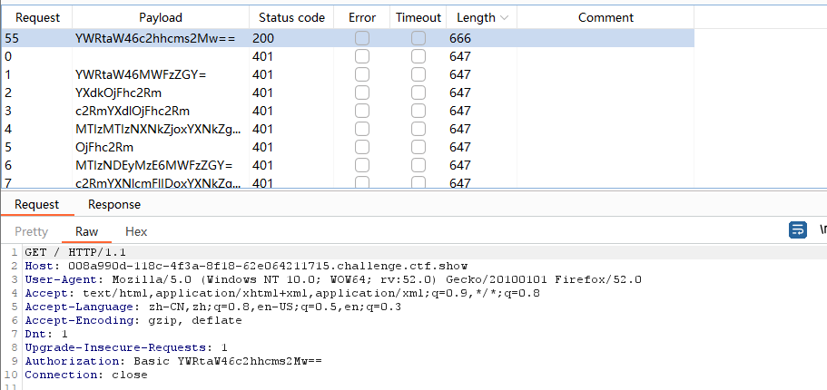

存在length不一样的字段

解码后得到账号密码

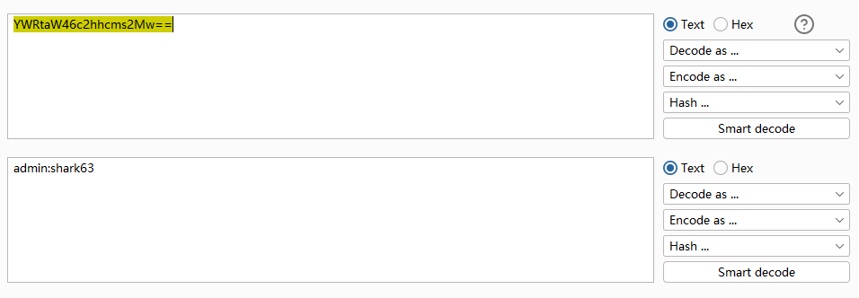

同时返回包中存在flag

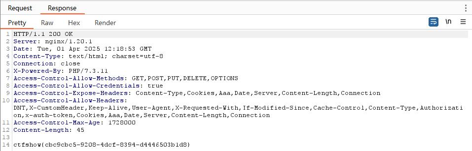